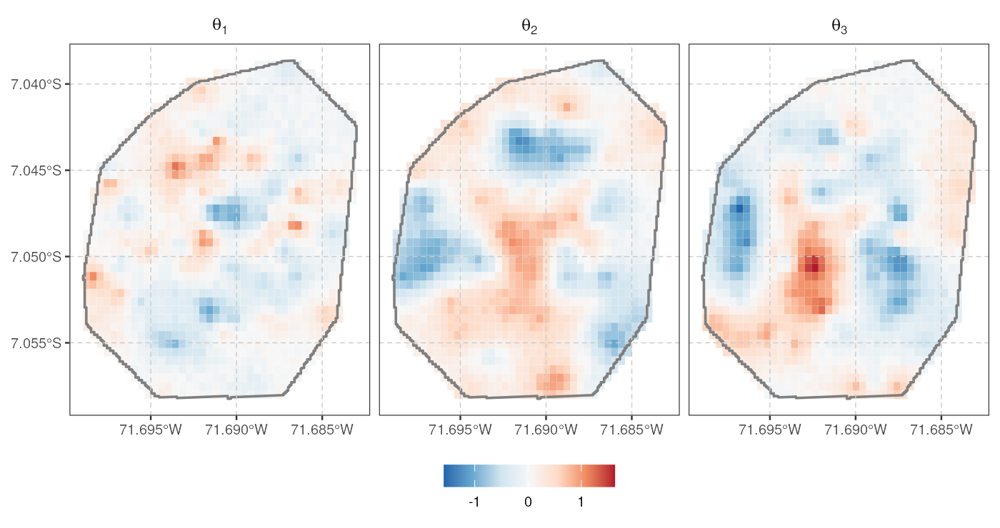
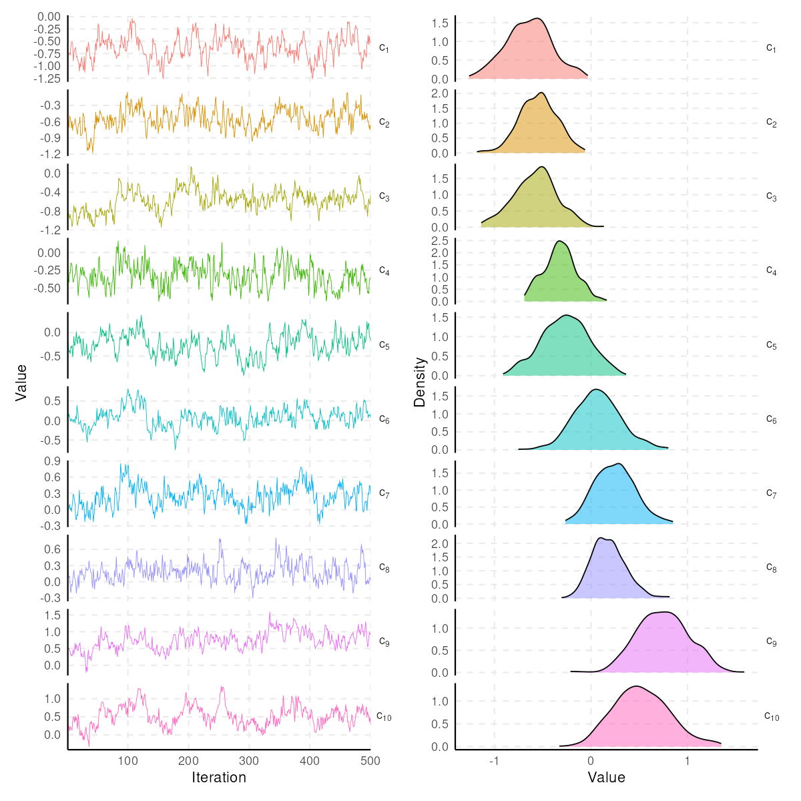

# spifa: Bayesian Spatial Item Factor Analysis

<!-- badges: start -->
[](https://github.com/ErickChacon/spifa/actions/workflows/R-CMD-check.yaml)
[](https://github.com/ErickChacon/spifa/actions/workflows/pkgdown.yaml)
<!-- badges: end -->



## Introduction

**spifa** fits spatial item factor analysis (IFA) models for binary
responses using full Bayesian inference (adaptive Metropolis-Hastings
within Gibbs sampling), via auxiliary variables with a probit link
function. The latent factors are modelled as the sum of a predictor effect,
a multivariate Gaussian process capturing spatial dependence, and a
multivariate non-spatial term, so spatially referenced constructs (e.g.
food insecurity or a socio-economic index measured at survey locations)
can be mapped and predicted at new locations. Standard exploratory and
confirmatory IFA are supported as particular cases, simply by dropping the
spatial structure.

The package implements the methodology described in "Mapping food
insecurity in the Brazilian Amazon using a spatial item factor analysis
model" (2025), published in *The Annals of Applied Statistics* at
<https://doi.org/10.1214/25-AOAS2072>. In addition to the core spatial item
factor analysis model, **spifa** offers tools for model diagnostics,
visualization, and summarizing results.

## Installation

You can install the development version from GitHub:

```r
remotes::install_github("ErickChacon/spifa")
```

## Basic usage

A minimal *spatial* item factor analysis fit on the bundled `ipixuna` dataset (a
simulated `sf` object with `items` responses for geo-referenced households). We
define the discrimination structure and fit the model with the default spatial
structure for each factor:

```r
library(spifa)

data(ipixuna)
nfactors <- 3
nitems <- ncol(ipixuna$items)

# define a restriction for the discrimination
A <- matrix(1, nitems, nfactors)
A[c(4, 8), 1] <- 0
A[c(4, 5, 6, 7, 8, 10), 2] <- 0
A[c(5, 6), 3] <- 0

# sampling from the posterior distribution
samples <- spifa(items ~ 1, data = ipixuna, nfactors = nfactors, niter = 1000,
  constraints = list(discrimination = A))

# visualize the easiness parameters (c)
plot(samples, select = "c", burnin = 500)
```



See `vignette("spifa")` for a full worked example.

## Citation

If you use **spifa** in your work, please cite both the paper that proposes
the underlying model and the package itself:

> Chacón-Montalván, E. A., Parry, L., Giorgi, E., Torres, P., Orellana,
> J. D. Y., Moraga, P., and Taylor, B. M. (2025). Mapping food insecurity in
> the Brazilian Amazon using a spatial item factor analysis model. *The
> Annals of Applied Statistics*, 19(4), 3438-3463.
> <https://doi.org/10.1214/25-AOAS2072>

```r
citation("spifa")
```

## See also

For item factor analysis *without* spatial structure, see the
[`mirt`](https://cran.r-project.org/package=mirt) package.
