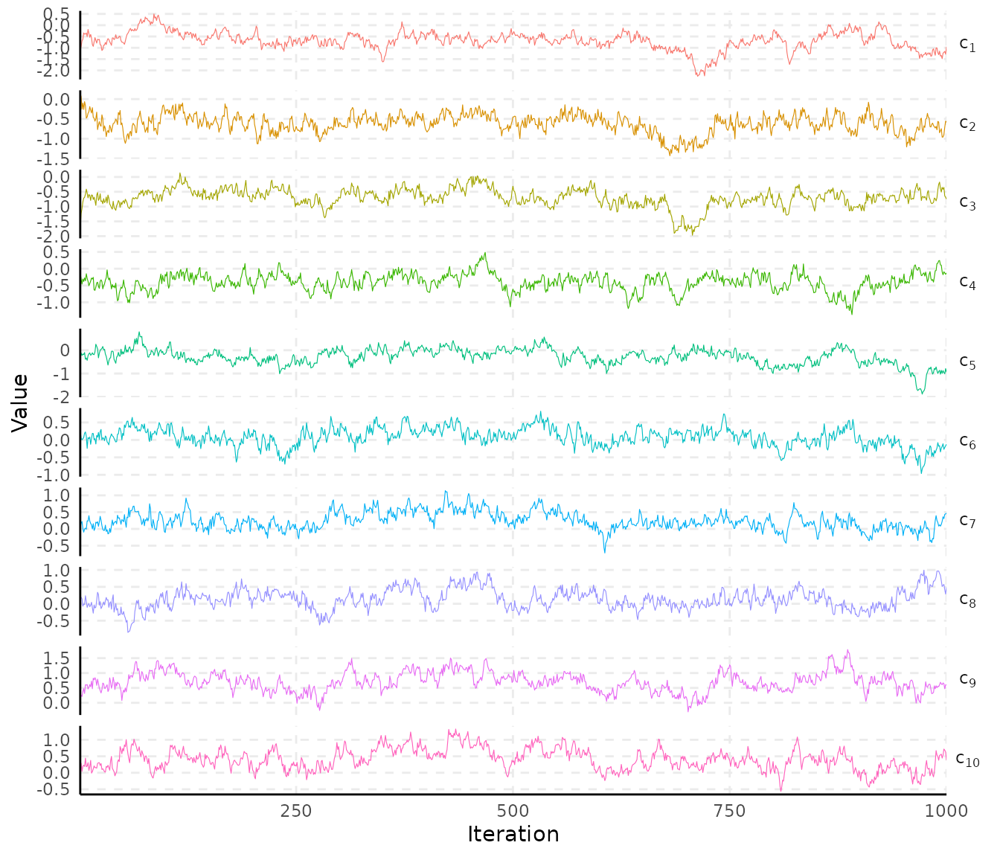
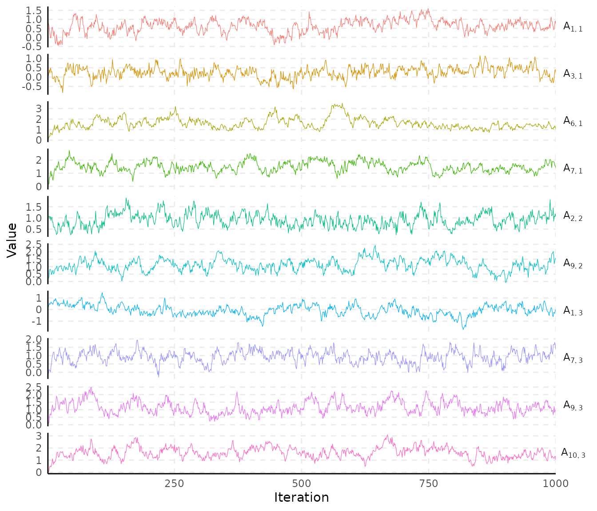
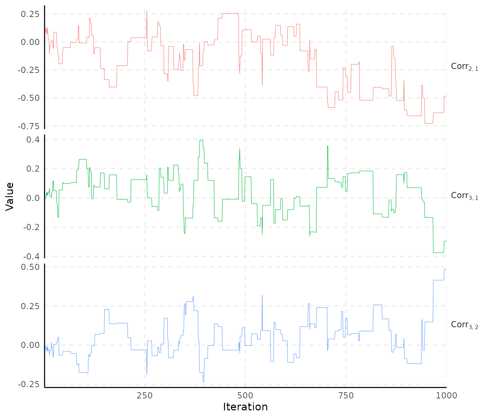
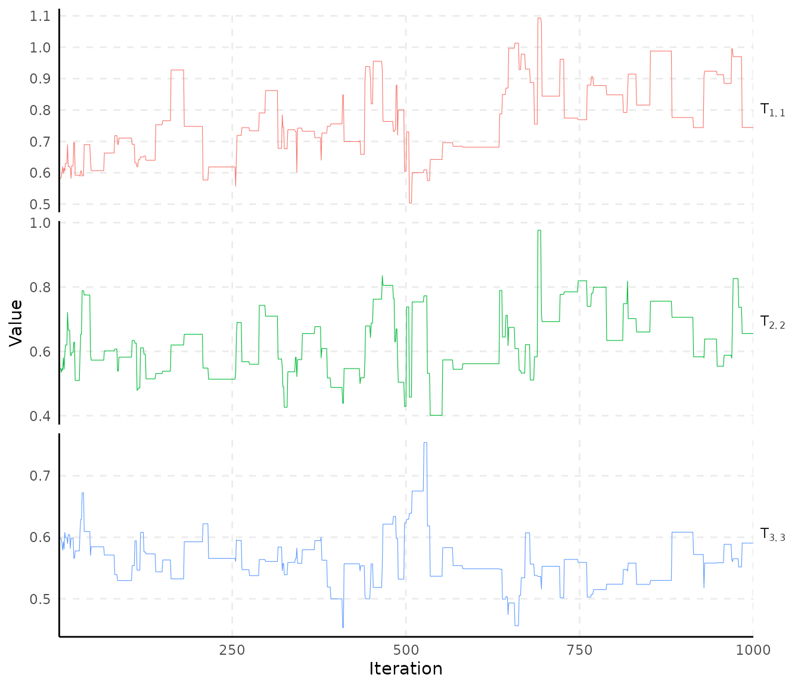
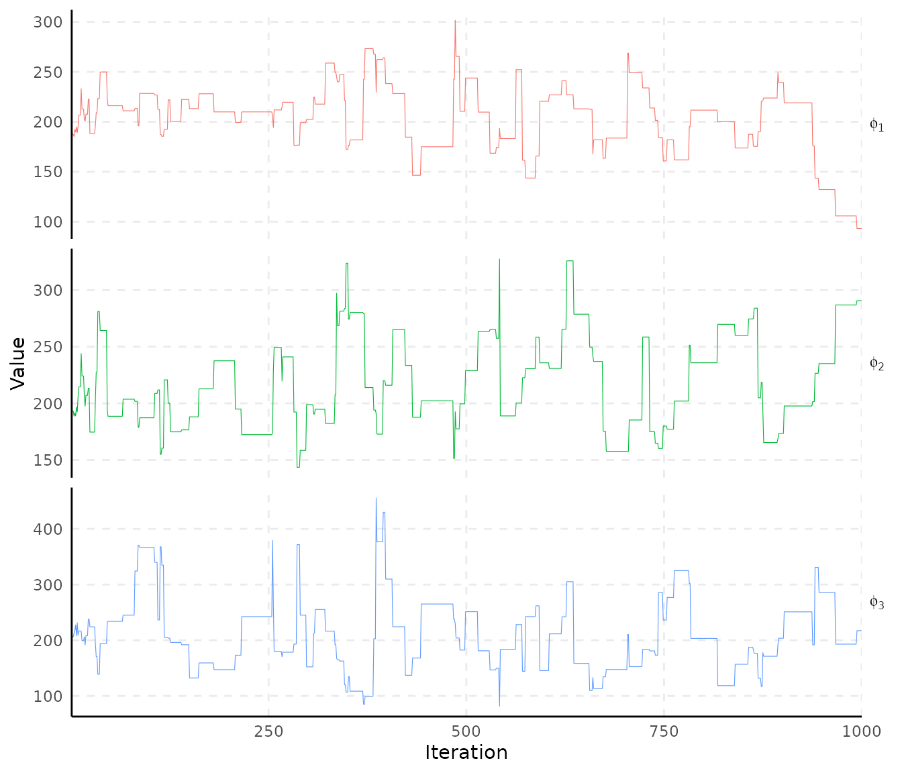
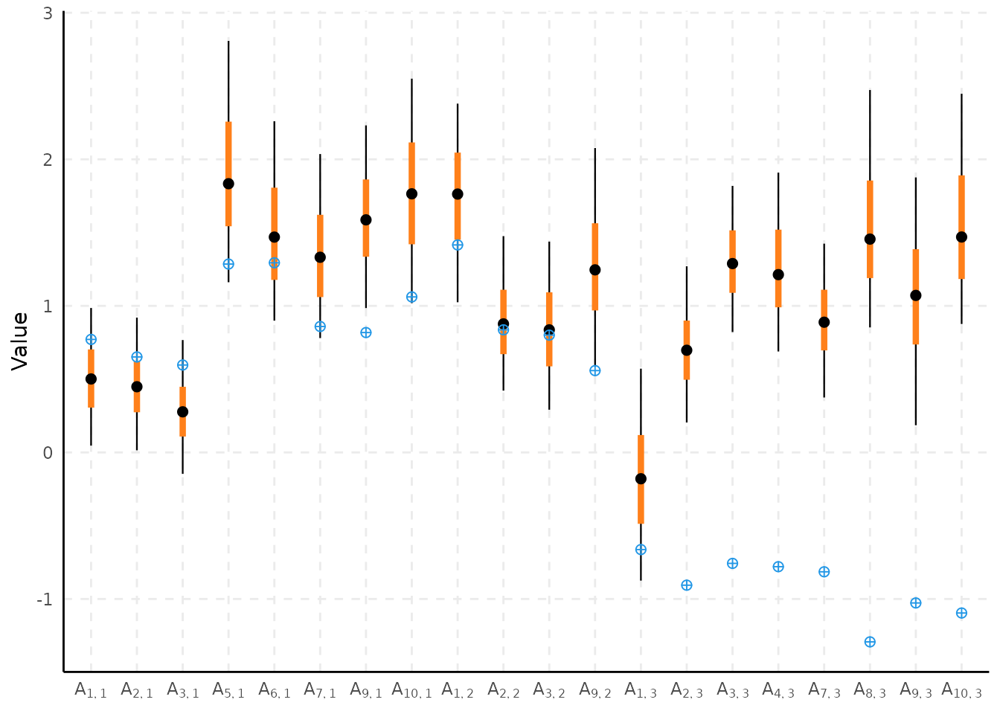

# Spatial Item Factor Analysis

## Introduction

In this vignette, we show how to use the **spifa** package to fit a
spatial multidimensional 2 parameter logistic model, as used in item
response theory. Let $`Y_{ij}`$ be the binary response for item $`j`$ in
individual $`i`$. The model can be defined using an auxiliary variable
$`Z_{ij}`$ such that

\$\$\begin{align} {Y}\_{ij} & = \left\lbrace \begin{array}\[2\]{cc} 1 &
\text{if} ~ {Z}\_{ij} \> 0\\ 0 & \text{otherwise} \end{array} \right.\\
{Z}\_{ij} & = c_j + a_j^\intercal\theta_i + \epsilon\_{ij}, \~~
\epsilon\_{ij} \sim {N}(0, 1) \end{align}\$\$

where the vector of latent abilities $`\theta_i`$ is modelled, in the
spatial case, as

``` math
\theta_i = X_i^\intercal B + w(s_i) + v_i,
```

the sum of a predictor effect ($`X_i^\intercal B`$, with $`X_i`$ the row
of predictors for individual $`i`$ and $`B`$ the matrix of effects), a
multivariate Gaussian process capturing spatial dependence ($`w(s_i)`$,
at location $`s_i`$), and a multivariate non-spatial term ($`v_i`$),
rather than assumed independent across individuals.

## Load required packages and data

``` r

library(dplyr)
```

    #> 
    #> Attaching package: 'dplyr'

    #> The following objects are masked from 'package:stats':
    #> 
    #>     filter, lag

    #> The following objects are masked from 'package:base':
    #> 
    #>     intersect, setdiff, setequal, union

``` r

library(ggplot2)
library(spifa)
library(sf)
```

    #> Linking to GEOS 3.12.1, GDAL 3.8.4, PROJ 9.4.0; sf_use_s2() is TRUE

``` r

data(ipixuna)
```

`ipixuna` has one row per (simulated) household, with a ten-item binary
`items` response matrix, a covariate `wealth`, and a spatial coordinate
`geometry`:

``` r

ipixuna |>
  dplyr::select(-geometry, -items) |>
  head(10) |>
  knitr::kable(digits = 2)
```

|  id | wealth | geometry                    |
|----:|-------:|:----------------------------|
|   1 |  -0.57 | POINT (-71.69689 -7.052244) |
|   2 |  -0.92 | POINT (-71.68695 -7.039144) |
|   3 |   1.23 | POINT (-71.68732 -7.047609) |
|   4 |   0.31 | POINT (-71.69005 -7.047915) |
|   5 |  -0.06 | POINT (-71.68464 -7.053396) |
|   6 |   2.05 | POINT (-71.69039 -7.042424) |
|   7 |   2.31 | POINT (-71.69486 -7.050021) |
|   8 |   0.17 | POINT (-71.6863 -7.047552)  |
|   9 |  -0.22 | POINT (-71.69208 -7.053133) |
|  10 |  -0.92 | POINT (-71.68778 -7.043805) |

The true generating parameters used to simulate the data (including the
discrimination structure) are stored as an attribute, which is
convenient both for setting sensible restrictions and for checking
recovery below:

``` r

parameters <- attr(ipixuna, "parameters")
str(parameters)
```

    #> List of 6
    #>  $ easiness      : num [1:10] -0.68 -0.51 -0.34 -0.17 0 0.17 0.34 0.51 0.68 0.85
    #>  $ discrimination: num [1:10, 1:3] 0.771 0.651 0.596 0 1.285 ...
    #>  $ abilities     : num [1:100, 1:3] 1.414 0.826 -1.613 -0.909 0.844 ...
    #>  $ effect        : num [1:3] -0.7 0.7 0.3
    #>  $ resid_params  :List of 2
    #>   ..$ sd  : num [1:3] 0.447 0.548 0.447
    #>   ..$ corr: num [1:3] -0.7 0.1 -0.1
    #>  $ mgp_params    :List of 2
    #>   ..$ sd : num [1:3] 0.632 0.548 0.707
    #>   ..$ phi: num [1:3] 100 150 250

## Fit a SPIFA model for the Ipixuna data

We restrict the discrimination matrix to the structure used to simulate
the data, and let the three latent factors follow independent Gaussian
processes (`W = diag(3)`) over the household coordinates. `niter` is
kept small here so the vignette builds quickly; in practice use a few
thousand iterations and check convergence (see
[`?plot_trace`](https://ErickChacon.github.io/spifa/reference/plot_trace.md)).

``` r

L_a <- (parameters$discrimination != 0) * 1
nfactors <- ncol(parameters$discrimination)

system.time(
  samples <- spifa(
    items ~ wealth, data = ipixuna, nfactors = nfactors,
    niter = 1000, thin = 1, standardize = FALSE,
    constraints = list(discrimination = L_a, loading = diag(nfactors),
      sd = parameters$resid_params$sd),
    priors = list(
      loading = list(initial = 0.6, mean = 0.6, sd = 0.4),
      range = list(initial = 200, mean = 200, sd = 0.4)))
  )
```

    #>    user  system elapsed 
    #>  46.473  16.846  16.000

``` r

samples
```

    #> Item factor analysis model: spifa_pred
    #> Formula: items ~ wealth
    #> Dimensions: 100 respondents, 10 items, 3 latent factors, 3 spatial processes
    #> MCMC: 1 chain, iter = 1000, thin = 1, samples = 1000
    #> 
    #> Item model parameters:
    #>           mean median   sd    q10    q90 ess_bulk rhat
    #> c[1]    -0.662 -0.636 0.43 -1.216 -0.145     28.8  1.0
    #> c[2]    -0.613 -0.603 0.24 -0.926 -0.317     45.6  1.0
    #> c[3]    -0.627 -0.639 0.24 -0.934 -0.294     35.9  1.0
    #> c[4]    -0.405 -0.400 0.22 -0.686 -0.128     49.1  1.0
    #> c[5]    -0.326 -0.334 0.34 -0.750  0.074     23.0  1.0
    #> c[6]     0.021  0.023 0.26 -0.327  0.359     29.0  1.0
    #> c[7]     0.140  0.139 0.28 -0.208  0.477     31.5  1.0
    #> c[8]     0.111  0.120 0.22 -0.152  0.389     43.2  1.0
    #> c[9]     0.584  0.593 0.37  0.101  1.049     21.2  1.0
    #> c[10]    0.322  0.301 0.33 -0.092  0.733     40.8  1.0
    #> A[1,1]   0.623  0.640 0.36  0.145  1.064     24.5  1.1
    #> A[2,1]   0.475  0.460 0.30  0.103  0.851     82.0  1.0
    #> A[3,1]   0.255  0.264 0.30 -0.138  0.626     24.2  1.1
    #> A[4,1]   0.000  0.000 0.00  0.000  0.000       NA   NA
    #> A[5,1]   2.019  1.967 0.58  1.363  2.856     33.1  1.1
    #> A[6,1]   1.601  1.508 0.52  1.044  2.246     24.9  1.0
    #> A[7,1]   1.491  1.468 0.40  0.977  2.035     57.0  1.0
    #> A[8,1]   0.000  0.000 0.00  0.000  0.000       NA   NA
    #> A[9,1]   1.472  1.458 0.40  0.993  1.955     33.9  1.1
    #> A[10,1]  1.740  1.725 0.48  1.142  2.364     52.2  1.0
    #> A[1,2]   1.977  1.868 0.73  1.088  2.889      5.8  1.2
    #> A[2,2]   0.912  0.904 0.30  0.533  1.305     57.5  1.0
    #> A[3,2]   0.690  0.678 0.32  0.303  1.107     89.4  1.0
    #> A[4,2]   0.000  0.000 0.00  0.000  0.000       NA   NA
    #> A[5,2]   0.000  0.000 0.00  0.000  0.000       NA   NA
    #> A[6,2]   0.000  0.000 0.00  0.000  0.000       NA   NA
    #> A[7,2]   0.000  0.000 0.00  0.000  0.000       NA   NA
    #> A[8,2]   0.000  0.000 0.00  0.000  0.000       NA   NA
    #> A[9,2]   1.113  1.113 0.42  0.584  1.653     43.6  1.0
    #> A[10,2]  0.000  0.000 0.00  0.000  0.000       NA   NA
    #> A[1,3]  -0.064 -0.067 0.47 -0.646  0.524     22.0  1.0
    #> A[2,3]   0.755  0.733 0.40  0.285  1.272     44.5  1.0
    #> A[3,3]   1.358  1.349 0.34  0.908  1.792     86.1  1.0
    #> A[4,3]   1.214  1.170 0.39  0.750  1.743     12.1  1.1
    #> A[5,3]   0.000  0.000 0.00  0.000  0.000       NA   NA
    #> A[6,3]   0.000  0.000 0.00  0.000  0.000       NA   NA
    #> A[7,3]   0.933  0.955 0.37  0.442  1.381     99.8  1.0
    #> A[8,3]   1.453  1.423 0.46  0.911  2.055     49.2  1.0
    #> A[9,3]   1.165  1.093 0.42  0.674  1.760     54.2  1.0
    #> A[10,3]  1.613  1.610 0.46  1.048  2.176     40.0  1.0
    #> 
    #> Factor model parameters:
    #>              mean  median     sd    q10     q90 ess_bulk rhat
    #> B[1,1]     -0.306  -0.304  0.086  -0.42  -0.198     79.5  1.0
    #> B[1,2]      0.083   0.084  0.104  -0.05   0.213     26.2  1.0
    #> B[1,3]     -0.170  -0.170  0.079  -0.27  -0.068    346.8  1.0
    #> T[1,1]      0.740   0.725  0.155   0.52   0.928      5.8  1.2
    #> T[2,2]      0.598   0.581  0.085   0.49   0.721     41.3  1.0
    #> T[3,3]      0.545   0.557  0.069   0.44   0.619      7.0  1.2
    #> phi[1]    202.588 209.928 34.498 161.92 243.845     35.8  1.1
    #> phi[2]    217.671 206.616 39.347 172.35 278.755     34.4  1.1
    #> phi[3]    208.616 201.712 63.953 137.07 285.840     38.2  1.0
    #> Corr[2,1]  -0.183  -0.104  0.266  -0.59   0.136      3.4  1.2
    #> Corr[3,1]   0.031   0.062  0.144  -0.14   0.184     29.3  1.1
    #> Corr[3,2]   0.056   0.047  0.131  -0.10   0.240     28.3  1.1
    #> 
    #> ess_bulk is the bulk effective sample size; rhat is the potential
    #> scale reduction factor on split chains (Rhat = 1 at convergence).
    #> Use summary() for the full set of statistics (incl. ess_tail).

``` r

attr(samples, "fit_args")$model_type
```

    #> [1] "spifa_pred"

## Summarise samples

``` r

summary(samples, burnin = 100, select = "c")
```

    #> # A tibble: 10 × 12
    #>    variable     mean   median    sd   mad   q2.5     q10     q90     q97.5 ess_bulk ess_tail  rhat
    #>    <chr>       <dbl>    <dbl> <dbl> <dbl>  <dbl>   <dbl>   <dbl>     <dbl>    <dbl>    <dbl> <dbl>
    #>  1 c[1]     -0.698   -0.668   0.412 0.440 -1.59  -1.24   -0.178  -0.00619     30.4      53.8  1.03
    #>  2 c[2]     -0.617   -0.603   0.240 0.237 -1.12  -0.933  -0.329  -0.152       39.4      84.8  1.00
    #>  3 c[3]     -0.613   -0.628   0.243 0.254 -1.04  -0.925  -0.272  -0.117       26.2     147.   1.05
    #>  4 c[4]     -0.392   -0.386   0.212 0.205 -0.824 -0.672  -0.118  -0.000719    40.5      80.8  1.07
    #>  5 c[5]     -0.356   -0.371   0.337 0.295 -0.976 -0.773   0.0492  0.390        5.03     20.7  1.16
    #>  6 c[6]      0.00137 -0.00708 0.266 0.278 -0.503 -0.341   0.343   0.498       16.7      32.7  1.09
    #>  7 c[7]      0.130    0.131   0.283 0.240 -0.435 -0.234   0.463   0.735       28.5      54.1  1.01
    #>  8 c[8]      0.136    0.138   0.203 0.193 -0.249 -0.120   0.397   0.556       42.6      94.6  1.05
    #>  9 c[9]      0.565    0.572   0.373 0.347 -0.220  0.0840  1.02    1.30        20.0      39.9  1.03
    #> 10 c[10]     0.321    0.306   0.331 0.326 -0.301 -0.101   0.722   1.01        39.4      67.6  1.00

## Visualize results

Traceplots of the easiness (`c`) and discrimination (`a`) parameters:

``` r

plot_trace(samples, select = "c")
```



``` r

plot_trace(samples, select = "A")
```



Traceplots of the residual correlation and of the Gaussian process
hyperparameters (loading matrix `T` and range `phi`):

``` r

plot_trace(samples, select = "Corr")
```



``` r

plot_trace(samples, select = "T")
```



``` r

plot_trace(samples, select = "phi")
```



Credible intervals for the discrimination parameters, against the true
simulated values:

``` r

plot_interval(samples, select = "A", burnin = 100,
              reference = parameters$discrimination)
```


