# Bayesian Spatial Item Factor Analysis

In this vignette, we show how to use the **spifa** package to fit a
spatial item factor model, summarise and visualize the posterior
samples, and predict and map the latent factors at new locations.

## Introduction

We will focus on the spatial item factor model proposed in
Chacón-Montalván et al. (2025). Let \\Y\_{ij}\\ be the binary response
for item \\j\\ in individual \\i\\. The model can be defined using an
auxiliary variable \\Z\_{ij}\\ such that:

\\ \begin{aligned} {Y}\_{ij} & = \begin{cases} 1, & \text{if} ~
{Z}\_{ij} \> 0\\ 0, & \text{otherwise} \end{cases}\\ {Z}\_{ij} & = c_j +
\boldsymbol{a}\_j^\intercal\boldsymbol{\theta}\_i + \epsilon\_{ij}, \~~
\epsilon\_{ij} \sim {N}(0, 1), \end{aligned} \\

where the easiness parameters \\c_j\\ define how common is to endorse
the item \\j\\, and the discrimination parameters \\\boldsymbol{a}\_j\\
define how important is item \\j\\ to discriminate the latent
factors/abilities \\\boldsymbol{\theta}\_i\\.

The vector of latent abilities \\\boldsymbol{\theta}\_i\\ is modelled in
terms of predictors \\\boldsymbol{x}\_i\\, a vector of Gaussian
processes \\\boldsymbol{w}(s_i)\\, and a multivariate non-spatial term
\\\boldsymbol{v}\_i\\: \\ \boldsymbol{\theta}\_i = \boldsymbol{B}
\boldsymbol{x}\_i + \boldsymbol{T} \boldsymbol{w}(s_i) +
\boldsymbol{v}\_i, \\ where \\\boldsymbol{B}\\ is the matrix of
multivariate effects of the predictors, \\\boldsymbol{T}\\ defines the
relationship between the spatial processes and the latent abilities, and
\\\boldsymbol{v}\_i\\ is allowed to have a correlations structure
\\\boldsymbol{R}\\.

This model is unidentifiable, so it is important to restrict the
discrimination parameters \\\boldsymbol{a}\_j\\ and set informative
priors for the spatial range of the Gaussian processes
\\\boldsymbol{w}(s_i)\\ before fitting it, to facilitate convergence of
the posterior sampling algorithm – in practice, both are best informed
by exploratory analysis (e.g. a preliminary non-spatial item factor
analysis for the former, an empirical variogram for the latter), though
we use them directly below without walking through that derivation. The
linear transformation \\\boldsymbol{T}\\, by contrast, is not determined
from exploratory analysis – it is a structural choice made by the user
(usually diagonal, i.e. one independent Gaussian process per factor),
though alternative structures can be specified and compared.

## Load required packages and data

``` r

library(spifa)
library(posterior)
```

    #> This is posterior version 1.7.0

    #> 
    #> Attaching package: 'posterior'

    #> The following objects are masked from 'package:stats':
    #> 
    #>     mad, sd, var

    #> The following objects are masked from 'package:base':
    #> 
    #>     %in%, match

``` r

library(ggplot2)
library(sf)
```

    #> Linking to GEOS 3.12.1, GDAL 3.8.4, PROJ 9.4.0; sf_use_s2() is TRUE

The `ipixuna` data under analysis is included in the **spifa** package:
a simulated dataset of 10 `items` responses on 100 household locations,
on the same area of study as in Chacón-Montalván et al. (2025). It is a
`sf` object containing the `items` responses as a matrix, locations
under the `geometry` column, and a predictor `wealth`.

``` r

data(ipixuna)
ipixuna
```

    #> Simple feature collection with 100 features and 3 fields
    #> Geometry type: POINT
    #> Dimension:     XY
    #> Bounding box:  xmin: -71.69841 ymin: -7.057682 xmax: -71.68347 ymax: -7.039144
    #> Geodetic CRS:  WGS 84
    #> First 10 features:
    #>    id      wealth items.1 items.2 items.3 items.4 items.5 items.6 items.7 items.8 items.9 items.10
    #> 1   1 -0.57212306       0       1       1       0       1       1       1       1       1        1
    #> 2   2 -0.92003870       1       0       0       1       0       1       1       1       1        0
    #> 3   3  1.23197630       1       1       1       1       0       0       0       1       1        1
    #> 4   4  0.30801774       0       0       0       0       0       0       0       0       0        0
    #> 5   5 -0.06247617       1       0       1       0       1       1       1       1       1        1
    #> 6   6  2.05414943       0       0       0       0       0       0       0       0       0        0
    #> 7   7  2.30552728       1       0       0       0       0       0       0       0       0        0
    #> 8   8  0.16913811       1       0       0       0       0       0       1       1       1        0
    #> 9   9 -0.21989753       0       0       0       0       1       0       0       0       0        0
    #> 10 10 -0.91744763       1       1       1       0       0       1       1       1       1        1
    #>                       geometry
    #> 1  POINT (-71.69689 -7.052244)
    #> 2  POINT (-71.68695 -7.039144)
    #> 3  POINT (-71.68732 -7.047609)
    #> 4  POINT (-71.69005 -7.047915)
    #> 5  POINT (-71.68464 -7.053396)
    #> 6  POINT (-71.69039 -7.042424)
    #> 7  POINT (-71.69486 -7.050021)
    #> 8   POINT (-71.6863 -7.047552)
    #> 9  POINT (-71.69208 -7.053133)
    #> 10 POINT (-71.68778 -7.043805)

The `items` can be easily obtained as an element of the data `ipixuna`:

``` r

ipixuna$items |> head()
```

    #>      [,1] [,2] [,3] [,4] [,5] [,6] [,7] [,8] [,9] [,10]
    #> [1,]    0    1    1    0    1    1    1    1    1     1
    #> [2,]    1    0    0    1    0    1    1    1    1     0
    #> [3,]    1    1    1    1    0    0    0    1    1     1
    #> [4,]    0    0    0    0    0    0    0    0    0     0
    #> [5,]    1    0    1    0    1    1    1    1    1     1
    #> [6,]    0    0    0    0    0    0    0    0    0     0

## Sample from the posterior of a SPIFA model

As mentioned before, an identifiable spifa model requires restricting
the discrimination parameters, along with adequate initial values and
priors for the spatial parameters (mainly the range). In practice, these
are best obtained from a preliminary analysis, as shown in
`vignette("vg04-mirt-variogram-workflow")`. Here, we instead assume the
discrimination structure and some initial knowledge of the spatial
parameters are already available, and focus on defining, fitting, and
diagnosing the model.

First, we obtain the number of items (10) and define the number of
factors (3) we will use:

``` r

nitems <- ncol(ipixuna$items)
nfactors <- 3
```

### Restrictions

We define the discrimination matrix (10x3): items 4 and 8 do not inform
factor 1, items 4, 5, 6, 7, 8, and 10 do not inform factor 2, and items
5 and 6 do not inform factor 3.

``` r

A <- matrix(1, nitems, nfactors)
A[c(4, 8), 1] <- 0
A[c(4, 5, 6, 7, 8, 10), 2] <- 0
A[c(5, 6), 3] <- 0
A
```

    #>       [,1] [,2] [,3]
    #>  [1,]    1    1    1
    #>  [2,]    1    1    1
    #>  [3,]    1    1    1
    #>  [4,]    0    0    1
    #>  [5,]    1    0    0
    #>  [6,]    1    0    0
    #>  [7,]    1    0    1
    #>  [8,]    0    0    1
    #>  [9,]    1    1    1
    #> [10,]    1    0    1

### Priors

In factor analysis, the sign of the factors is not identifiable, so we
need to fix the direction of each factor (which determines how we
interpret it). A common way to do this is to set a strong positive or
negative prior on a few discrimination parameters. The discrimination
parameters are assumed to have a Normal prior, so `mean`/`sd` are
directly its mean and standard deviation. Here, we set the mean prior to
1 for items 5 and 6 on factor 1, and to -1 for items 4 and 8 on factor
3, each with a standard deviation prior of 0.45:

``` r

A_mean <- matrix(0, nitems, nfactors)
A_mean[c(5, 6), 1] <- 1
A_mean[c(4, 8), 3] <- -1
A_mean
```

    #>       [,1] [,2] [,3]
    #>  [1,]    0    0    0
    #>  [2,]    0    0    0
    #>  [3,]    0    0    0
    #>  [4,]    0    0   -1
    #>  [5,]    1    0    0
    #>  [6,]    1    0    0
    #>  [7,]    0    0    0
    #>  [8,]    0    0   -1
    #>  [9,]    0    0    0
    #> [10,]    0    0    0

``` r

A_sd <- matrix(1, nitems, nfactors)
A_sd[A_mean != 0] <- 0.45
A_sd
```

    #>       [,1] [,2] [,3]
    #>  [1,] 1.00    1 1.00
    #>  [2,] 1.00    1 1.00
    #>  [3,] 1.00    1 1.00
    #>  [4,] 1.00    1 0.45
    #>  [5,] 0.45    1 1.00
    #>  [6,] 0.45    1 1.00
    #>  [7,] 1.00    1 1.00
    #>  [8,] 1.00    1 0.45
    #>  [9,] 1.00    1 1.00
    #> [10,] 1.00    1 1.00

Similarly, we will define the prior for the range parameter of the
Gaussian processes. By default the
[`spifa()`](https://ErickChacon.github.io/spifa/reference/spifa.md)
function introduces 1 GP per factor, meaning that 3 range parameters
will be used in the model. Since the range must be positive, it is
instead assumed to have a Log-Normal prior: `mean`/`sd` are the mean and
standard deviation of its logarithm, not of the range itself. The range
is in the same units as the coordinates (metres here); `150` is a
plausible order of magnitude for the spacing between households in this
study area. If we want to set the same prior for all three, we can
define a single mean and standard deviation that will be recycled across
them:

``` r

phi_mean <- 150
phi_sd <- 0.4
```

### Sampling

The function
[`spifa()`](https://ErickChacon.github.io/spifa/reference/spifa.md) is
used to sample from the posterior distribution of the model. The main
arguments are:

- `formula`: expression to define the response items and predictors to
  include in the latent abilities,
- `data`: a `sf` object containing the terms defined in `formula`,
- `nfactors`: the number of factors for the model,
- `niter`, `thin`, `burnin`: usual sampling arguments,
- `constraints`: a named list of constraints for certain parameters,
- `priors`: a named list of prior information including initial values.

In the following, we fit a spifa model with `3` latent factors,
explained by `wealth`, constraints for the *discrimination* parameters
and priors for the *discrimination* and *range* parameters. By default,
it will introduce a GP for each latent factor.

``` r

samples <- spifa(
  items ~ wealth, data = ipixuna, nfactors = nfactors,
  burnin = 10000, niter = 8000, thin = 2,
  constraints = list(discrimination = A),
  priors = list(
    discrimination = list(initial = A_mean, mean = A_mean, sd = A_sd),
    range = list(initial = phi_mean, mean = phi_mean, sd = phi_sd)
  )
)
samples
```

    #> Item factor analysis model: spifa_pred
    #> Formula: items ~ wealth
    #> Dimensions: 100 respondents, 10 items, 3 latent factors, 3 spatial processes
    #> MCMC: 1 chain, iter = 7999, thin = 2, samples = 4000
    #> 
    #> Item model parameters:
    #>          mean median   sd    q10    q90 ess_bulk rhat
    #> c[1]    -0.57 -0.548 0.34 -1.010 -0.151      240    1
    #> c[2]    -0.58 -0.562 0.24 -0.893 -0.286      202    1
    #> c[3]    -0.66 -0.651 0.30 -1.028 -0.296      195    1
    #> c[4]    -0.39 -0.384 0.20 -0.653 -0.137      371    1
    #> c[5]    -0.28 -0.281 0.24 -0.595  0.015      368    1
    #> c[6]     0.03  0.028 0.22 -0.251  0.307      457    1
    #> c[7]     0.17  0.167 0.26 -0.146  0.497      244    1
    #> c[8]     0.10  0.106 0.21 -0.166  0.367      274    1
    #> c[9]     0.68  0.667 0.37  0.229  1.151      161    1
    #> c[10]    0.35  0.337 0.34 -0.062  0.781      205    1
    #> A[1,1]   0.11  0.106 0.29 -0.255  0.464      418    1
    #> A[2,1]   0.30  0.297 0.23  0.024  0.592      575    1
    #> A[3,1]   0.12  0.125 0.25 -0.180  0.434      465    1
    #> A[5,1]   1.29  1.278 0.26  0.958  1.616      537    1
    #> A[6,1]   1.15  1.134 0.25  0.841  1.476      529    1
    #> A[7,1]   1.12  1.077 0.35  0.716  1.606      236    1
    #> A[9,1]   1.15  1.115 0.38  0.695  1.635      253    1
    #> A[10,1]  1.44  1.404 0.40  0.953  1.966      204    1
    #> A[1,2]  -1.30 -1.272 0.42 -1.841 -0.790      130    1
    #> A[2,2]  -0.54 -0.521 0.30 -0.933 -0.177      302    1
    #> A[3,2]  -0.54 -0.515 0.32 -0.964 -0.149      220    1
    #> A[9,2]  -0.84 -0.826 0.37 -1.314 -0.397      231    1
    #> A[1,3]  -0.23 -0.235 0.35 -0.668  0.205      153    1
    #> A[2,3]  -0.62 -0.606 0.27 -0.977 -0.307      321    1
    #> A[3,3]  -1.09 -1.073 0.34 -1.544 -0.678      233    1
    #> A[4,3]  -0.83 -0.812 0.22 -1.123 -0.563      384    1
    #> A[7,3]  -0.66 -0.640 0.25 -0.977 -0.354      513    1
    #> A[8,3]  -0.93 -0.915 0.22 -1.219 -0.641      691    1
    #> A[9,3]  -0.98 -0.967 0.35 -1.441 -0.546      192    1
    #> A[10,3] -1.13 -1.099 0.33 -1.579 -0.723      303    1
    #> 
    #> Factor model parameters:
    #>               mean  median    sd    q10    q90 ess_bulk rhat
    #> B[1,1]     -0.3541  -0.347  0.11 -0.500  -0.21      289  1.0
    #> B[1,2]     -0.0346  -0.033  0.11 -0.176   0.10      691  1.0
    #> B[1,3]      0.1965   0.193  0.10  0.067   0.33      543  1.0
    #> T[1,1]      0.9733   0.963  0.15  0.784   1.18       59  1.0
    #> T[2,2]      1.0059   0.979  0.20  0.763   1.27       48  1.0
    #> T[3,3]      0.9880   0.982  0.15  0.804   1.18       86  1.0
    #> phi[1]     80.0766  76.948 23.90 52.074 110.86       87  1.0
    #> phi[2]    155.1564 144.819 51.94 98.135 229.48       74  1.0
    #> phi[3]    127.1628 122.235 41.98 78.900 184.49       67  1.1
    #> Corr[2,1]   0.0063   0.013  0.45 -0.601   0.60      108  1.0
    #> Corr[3,1]  -0.3245  -0.360  0.37 -0.779   0.19      100  1.0
    #> Corr[3,2]   0.0034   0.033  0.50 -0.683   0.69       96  1.0
    #> 
    #> ess_bulk is the bulk effective sample size; rhat is the potential
    #> scale reduction factor on split chains (Rhat = 1 at convergence).
    #> Use summary() for the full set of statistics (incl. ess_tail).

The [`print()`](https://rdrr.io/r/base/print.html) method shows metadata
of the model such as *model type*, *formula*, *dimensions*, MCMC
dimensions including the number of saved *samples*. Additionally, it
shows the summary and diagnostics of the item model parameters (easiness
and discrimination), and the factor model parameters (effects, loading,
range, and correlation). Among the diagnostics, `ess_bulk` is the bulk
effective sample size and `rhat` is the potential scale reduction factor
on split chains, which should be close to 1 at convergence.

## Summarise and visualize samples

### Summary

While [`print()`](https://rdrr.io/r/base/print.html) gives a quick
overview, [`summary()`](https://rdrr.io/r/base/summary.html) computes
the full set of posterior statistics (mean, median, sd, mad, quantiles,
`ess_bulk`, `ess_tail`, and `rhat`) for a chosen parameter group,
returned as a tidy tibble. Its main arguments are `select` (the
parameter group, e.g. `"c"`, `"A"`, `"phi"`), and `burnin`/`thin`, in
case we want to discard some initial samples or thin them further before
summarising:

``` r

summary(samples, select = "c")
```

    #> # A tibble: 10 × 12
    #>    variable    mean  median    sd   mad    q2.5     q10     q90    q97.5 ess_bulk ess_tail  rhat
    #>    <chr>      <dbl>   <dbl> <dbl> <dbl>   <dbl>   <dbl>   <dbl>    <dbl>    <dbl>    <dbl> <dbl>
    #>  1 c[1]     -0.567  -0.548  0.339 0.326 -1.29   -1.01   -0.151   0.0643      240.     508.  1.00
    #>  2 c[2]     -0.577  -0.562  0.245 0.234 -1.10   -0.893  -0.286  -0.117       202.     533.  1.00
    #>  3 c[3]     -0.660  -0.651  0.297 0.287 -1.26   -1.03   -0.296  -0.0895      195.     417.  1.00
    #>  4 c[4]     -0.388  -0.384  0.205 0.199 -0.816  -0.653  -0.137  -0.00393     371.    1146.  1.00
    #>  5 c[5]     -0.285  -0.281  0.241 0.234 -0.771  -0.595   0.0154  0.193       368.     951.  1.00
    #>  6 c[6]      0.0297  0.0280 0.221 0.218 -0.394  -0.251   0.307   0.482       457.    1033.  1.00
    #>  7 c[7]      0.172   0.167  0.260 0.249 -0.324  -0.146   0.497   0.709       244.     611.  1.00
    #>  8 c[8]      0.102   0.106  0.214 0.208 -0.327  -0.166   0.367   0.519       274.     717.  1.01
    #>  9 c[9]      0.678   0.667  0.374 0.343 -0.0242  0.229   1.15    1.48        161.     329.  1.00
    #> 10 c[10]     0.352   0.337  0.339 0.321 -0.282  -0.0617  0.781   1.05        205.     479.  1.00

### Plot

[`plot()`](https://rdrr.io/r/graphics/plot.default.html) gives a quick
overview of a fitted model: traceplots and density plots, side by side,
for the `easiness` and `discrimination` parameters by default.

``` r

plot(samples)
```

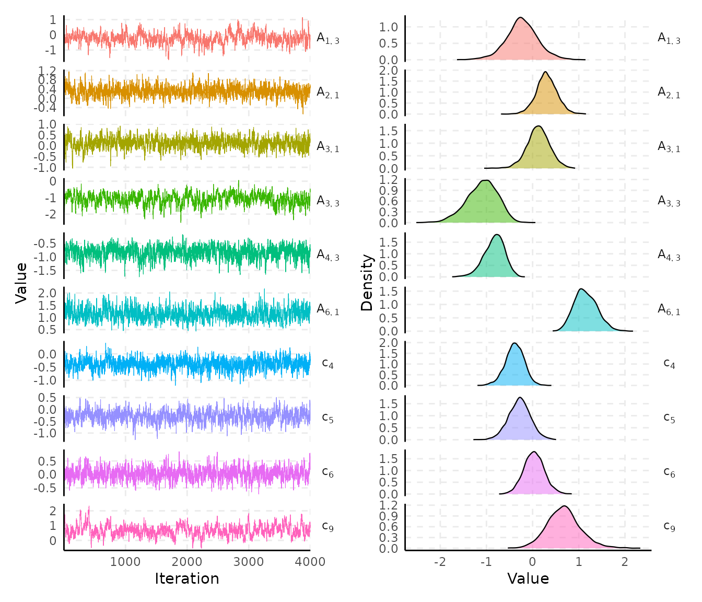

Use the `select` argument for a specific parameter group and `nshow` to
define the number of random parameters to show:

``` r

plot(samples, select = "c", nshow = 5)
```

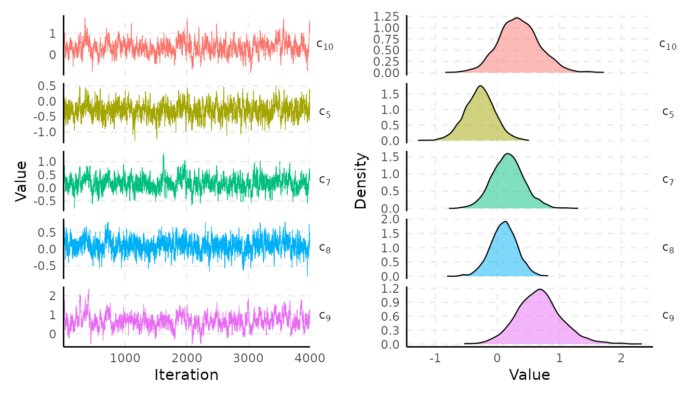

### Plotting functions

For more flexibility, **spifa** provides three individual plotting
functions:

- [`plot_trace()`](https://ErickChacon.github.io/spifa/reference/plot_trace.md),
- [`plot_density()`](https://ErickChacon.github.io/spifa/reference/plot_density.md),
- [`plot_interval()`](https://ErickChacon.github.io/spifa/reference/plot_interval.md)

They take as input the spifa `samples` with the `select` argument to
define the parameter group.

#### Trace plots

[`plot_trace()`](https://ErickChacon.github.io/spifa/reference/plot_trace.md)
draws the values against iteration per parameter. By default, it plots
one panel per parameter (`facet = TRUE`), or all of them in a single
panel when `facet = FALSE`.

Traceplots of the residual correlation:

``` r

plot_trace(samples, select = "Corr")
```

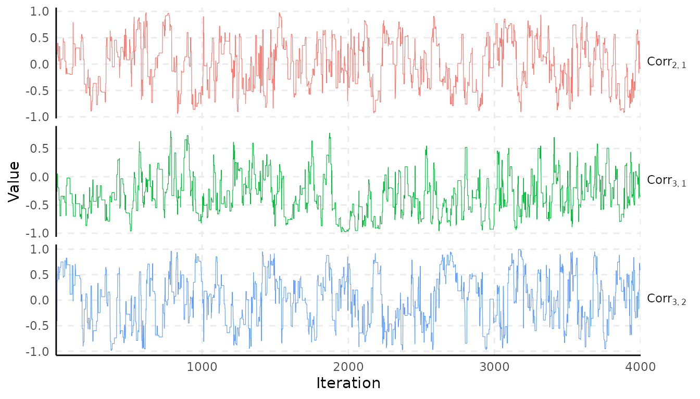

Traceplots of the range parameter of the GPs:

``` r

plot_trace(samples, select = "phi", facet = FALSE)
```

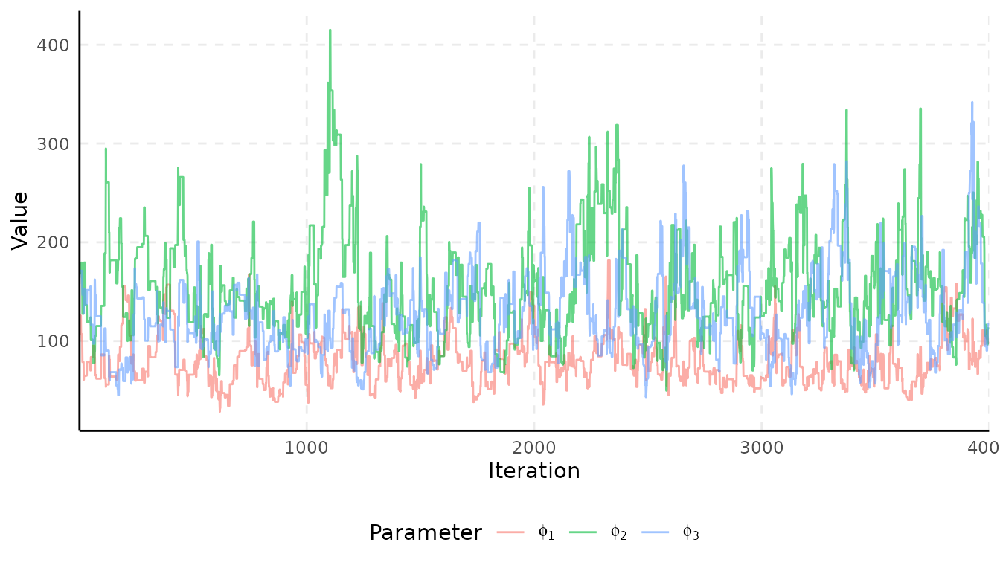

#### Density plots

[`plot_density()`](https://ErickChacon.github.io/spifa/reference/plot_density.md)
draws the posterior density of each parameter in the selected group.
Similar to
[`plot_trace()`](https://ErickChacon.github.io/spifa/reference/plot_trace.md),
you can control the `facet` argument.

Comparing the easiness parameters:

``` r

plot_density(samples, select = "c")
```

    #> Picking joint bandwidth of 0.0451

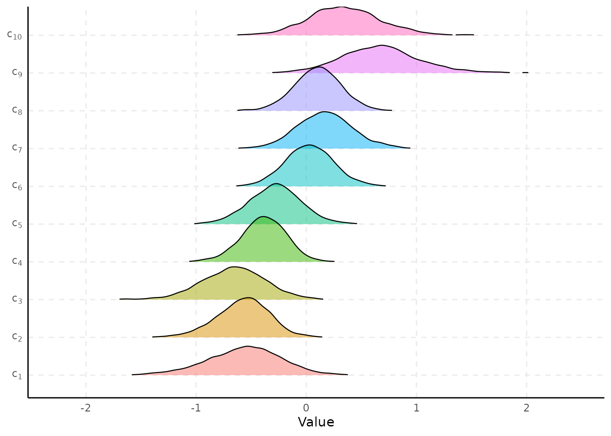

Comparing the predictor effects:

``` r

plot_density(samples, select = "B", facet = TRUE, facet_scales = "free_y")
```

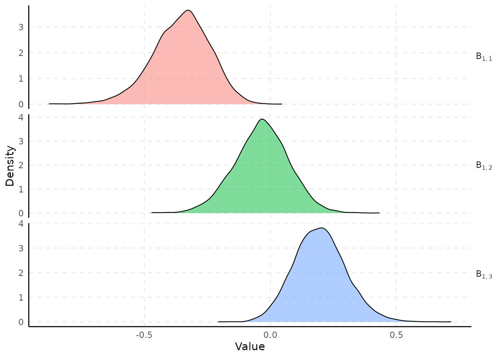

#### Interval plots

[`plot_interval()`](https://ErickChacon.github.io/spifa/reference/plot_interval.md)
draws the posterior mean/median and credible interval of each parameter
in the selected group.

Compare the discrimination parameters:

``` r

plot_interval(samples, select = "A")
```

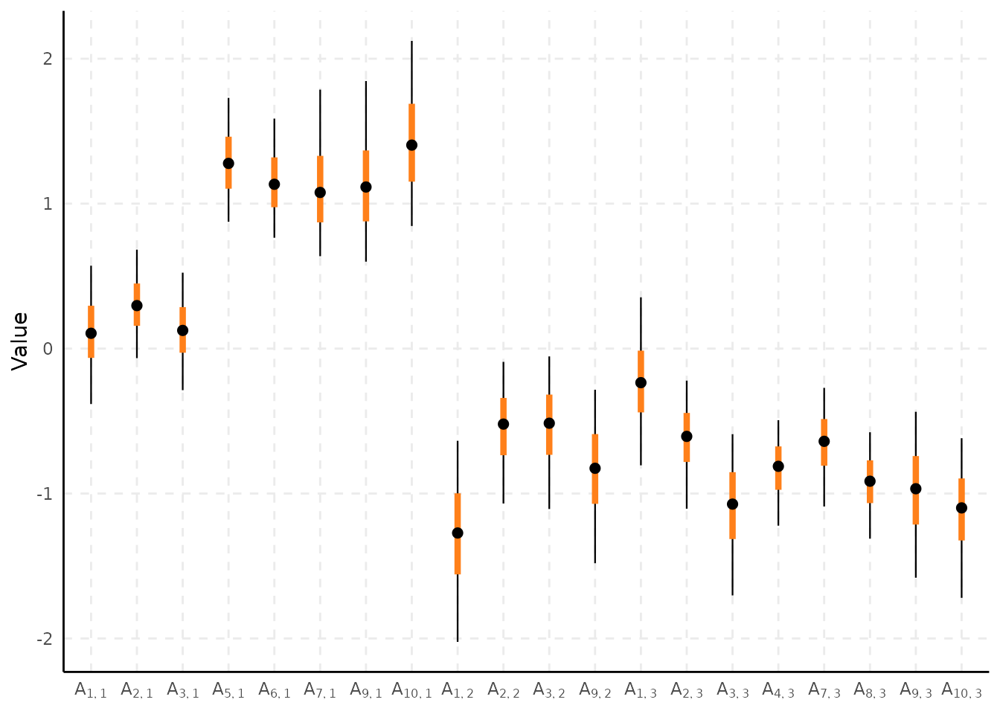

Compare the range parameters:

``` r

plot_interval(samples, select = "phi", horizontal = TRUE)
```

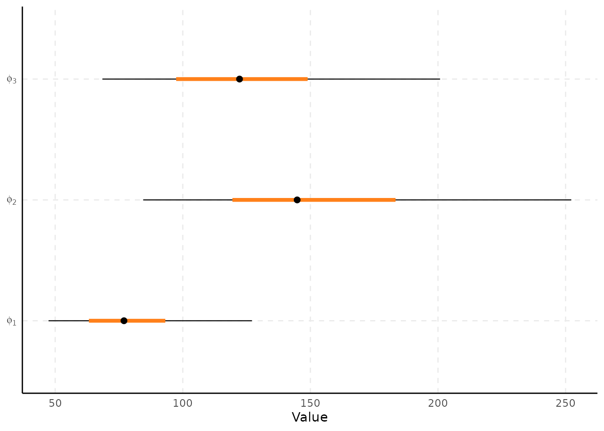

## Predict and map the latent factors

**spifa** provides Bayesian prediction of the latent factors at (i) the
observed locations and (ii) new locations through the
[`predict()`](https://rdrr.io/r/stats/predict.html) function.

### Observed locations

By default [`predict()`](https://rdrr.io/r/stats/predict.html) will
simply return the samples of the latent factors at observed locations as
a
[`posterior::draws_array()`](https://mc-stan.org/posterior/reference/draws_array.html)
object:

``` r

pred_samples <- predict(samples)
as_draws_df(pred_samples)
```

    #> # A draws_df: 4000 iterations, 1 chains, and 300 variables
    #>    Theta[1,1] Theta[2,1] Theta[3,1] Theta[4,1] Theta[5,1] Theta[6,1] Theta[7,1] Theta[8,1]
    #> 1       0.377     -0.270      -0.88      -0.71       0.93      -1.05      -0.60      0.708
    #> 2       1.383     -0.855      -0.28      -1.28       1.17      -0.66      -1.05     -0.101
    #> 3       0.657     -0.046      -0.83      -1.19       0.95      -0.98      -1.43     -0.662
    #> 4       0.680     -0.132      -1.03      -1.06       0.18      -1.20      -0.25      0.075
    #> 5       0.235     -0.536      -1.24      -1.30      -0.08      -0.77      -0.69     -0.274
    #> 6       0.871     -0.050      -0.86      -1.39       0.43      -0.80      -0.56     -0.388
    #> 7       0.344     -0.058      -0.63      -1.38      -0.22      -1.18      -0.49     -0.725
    #> 8       0.561     -0.574      -0.47      -0.50       1.14      -1.54      -0.16     -0.593
    #> 9      -0.065     -0.339      -0.48      -0.57       0.54      -1.27      -0.59     -0.704
    #> 10      0.918      0.066      -0.43      -0.82       0.25      -0.57      -0.16      0.252
    #> # ... with 3990 more draws, and 292 more variables
    #> # ... hidden reserved variables {'.chain', '.iteration', '.draw'}

We can visualize a summary (`mean` by default) of these predictive
samples using
[`plot_predict()`](https://ErickChacon.github.io/spifa/reference/plot_predict.md)
and integrate it with `ggplot2` functionality:

``` r

plot_predict(pred_samples) +
  scale_colour_distiller(palette = "RdBu")
```

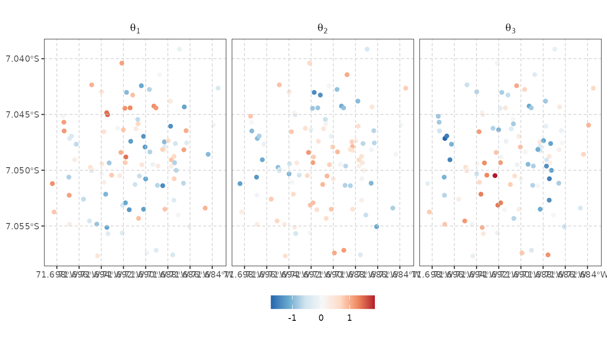

### New locations

If prediction is desired for new location/profiles, then the argument
`newdata` can be provided, which is expected to be a `sf`/`sfc` object
containing the new location/profiles.

First, we create a grid where prediction will be performed. Then, we
create a `newdata` `sf` object using a predictor profile representing an
individual with average (standardized) wealth:

``` r

bnd <- st_geometry(ipixuna) |>
  st_union() |>
  st_convex_hull() |>
  st_buffer(50)

newdata <- st_sf(wealth = 0, geometry = st_make_grid(bnd, n = c(40, 40))) |>
  st_filter(bnd)
newdata
```

    #> Simple feature collection with 1314 features and 1 field
    #> Geometry type: POLYGON
    #> Dimension:     XY
    #> Bounding box:  xmin: -71.69895 ymin: -7.058242 xmax: -71.683 ymax: -7.038643
    #> Geodetic CRS:  WGS 84
    #> First 10 features:
    #>    wealth                       geometry
    #> 1       0 POLYGON ((-71.69536 -7.0582...
    #> 2       0 POLYGON ((-71.69496 -7.0582...
    #> 3       0 POLYGON ((-71.69456 -7.0582...
    #> 4       0 POLYGON ((-71.69416 -7.0582...
    #> 5       0 POLYGON ((-71.69376 -7.0582...
    #> 6       0 POLYGON ((-71.69336 -7.0582...
    #> 7       0 POLYGON ((-71.69297 -7.0582...
    #> 8       0 POLYGON ((-71.69257 -7.0582...
    #> 9       0 POLYGON ((-71.69217 -7.0582...
    #> 10      0 POLYGON ((-71.69177 -7.0582...

We perform prediction for this `newdata` and thin the posterior samples
to reduce computational cost:

``` r

pred_samples <- predict(samples, newdata = newdata, thin = 10)
```

Now, we use the
[`plot_predict()`](https://ErickChacon.github.io/spifa/reference/plot_predict.md)
function to visualize the predictive `mean` by default.

``` r

plot_predict(pred_samples, boundary = bnd) +
  scale_fill_distiller(palette = "RdBu") +
  labs(title = "Predictive mean")
```

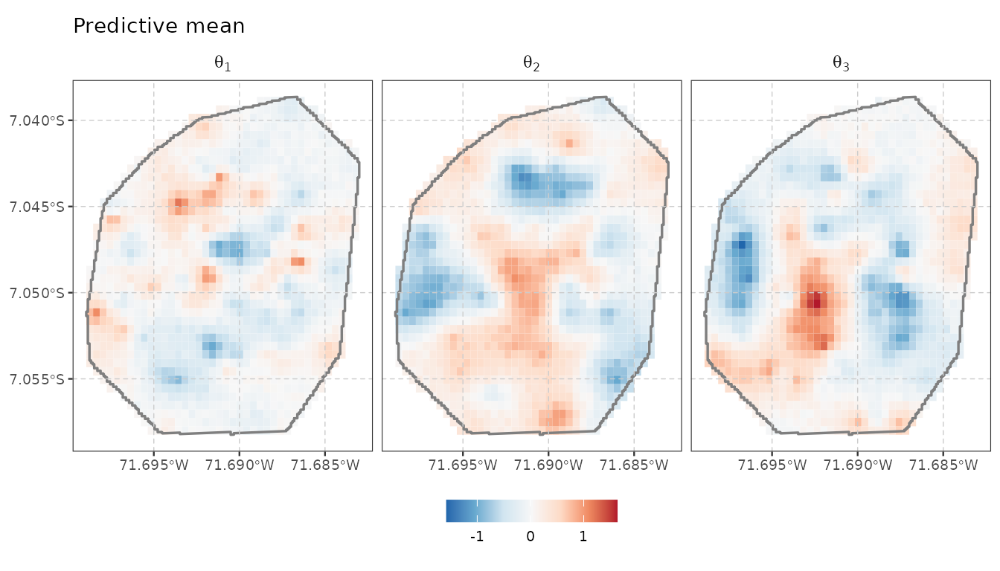

Other summaries can be mapped by simply providing a function in the
`stat` argument:

``` r

plot_predict(pred_samples, boundary = bnd, stat = sd) +
  scale_fill_viridis_c(option = "magma") +
  labs(title = "Predictive standard deviation")
```

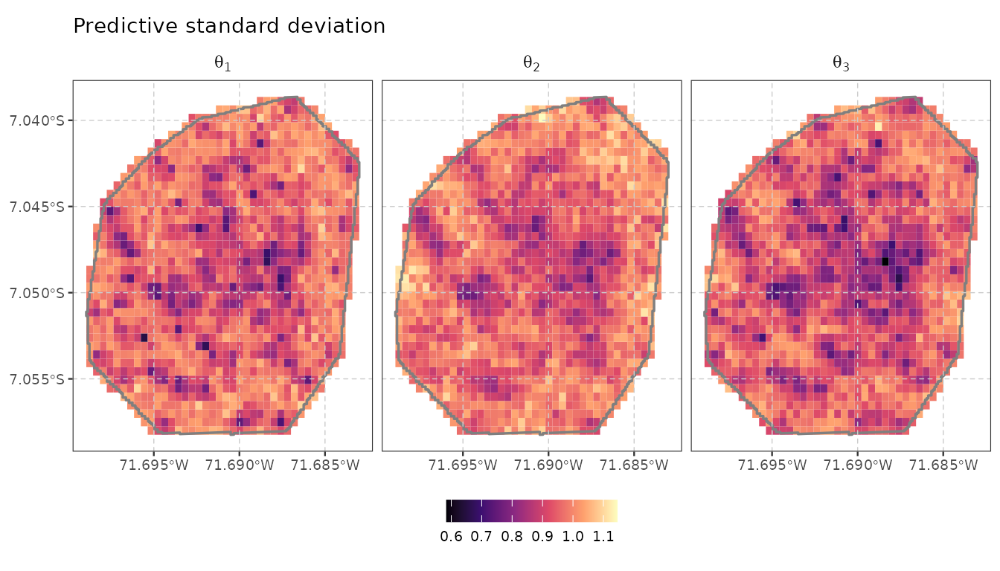

Custom functions can easily be provided, for example, we can plot the
probability of exceeding the value of 1 to identify hotspots:

``` r

plot_predict(pred_samples, boundary = bnd, stat = function (v) mean(v > 1)) +
  scale_fill_viridis_c(limits = c(0, 1), direction = -1) +
  labs(title = expression(paste("Exceedance probability: ", P(theta[j] > 1))))
```

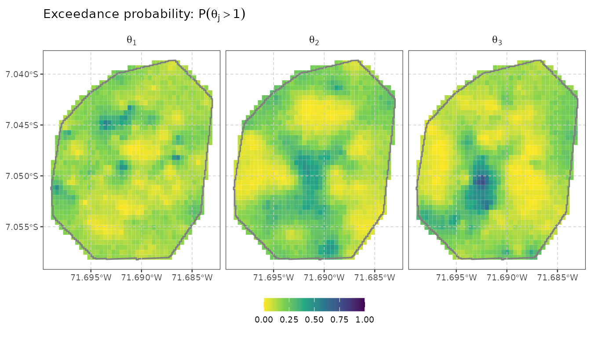

## References

Chacón-Montalván, Erick A., Luke Parry, Emanuele Giorgi, et al. 2025.
“Mapping Food Insecurity in the Brazilian Amazon Using a Spatial Item
Factor Analysis Model.” *The Annals of Applied Statistics* 19 (4):
3438–63. <https://doi.org/10.1214/25-AOAS2072>.
