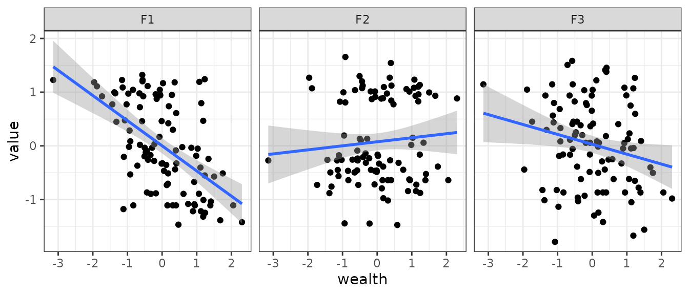
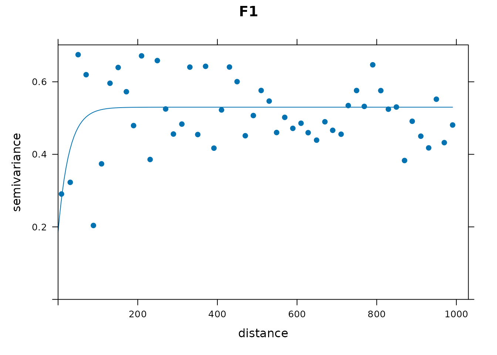
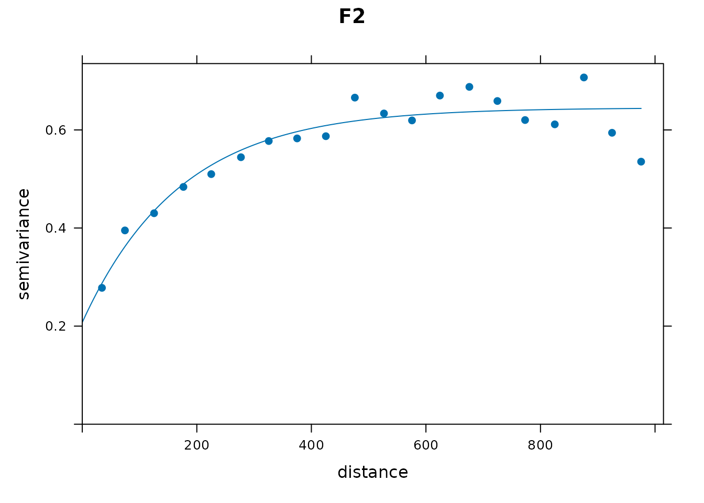
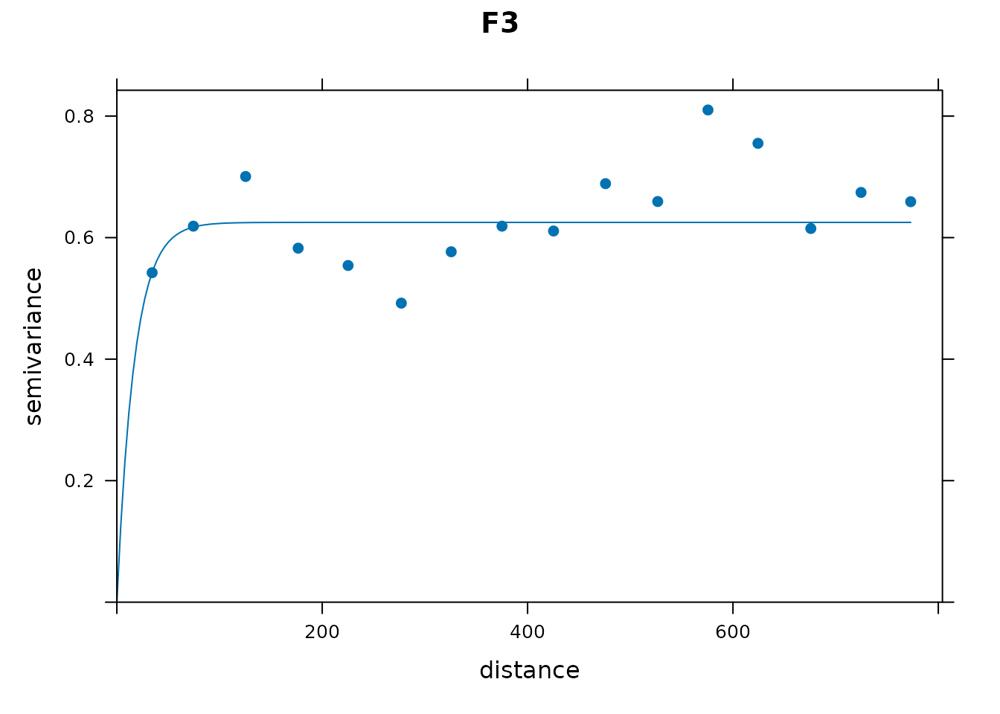
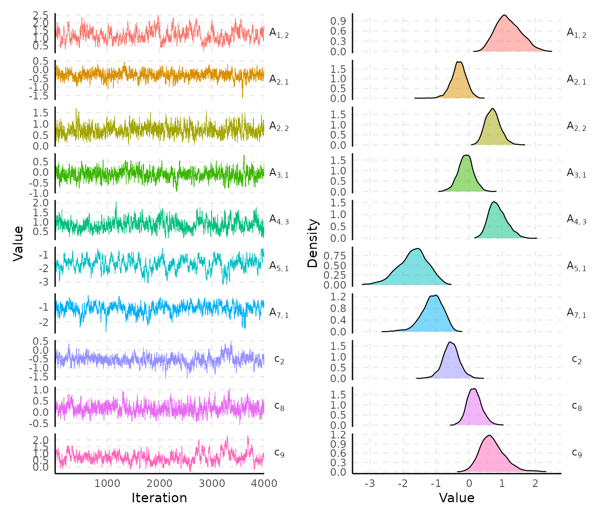
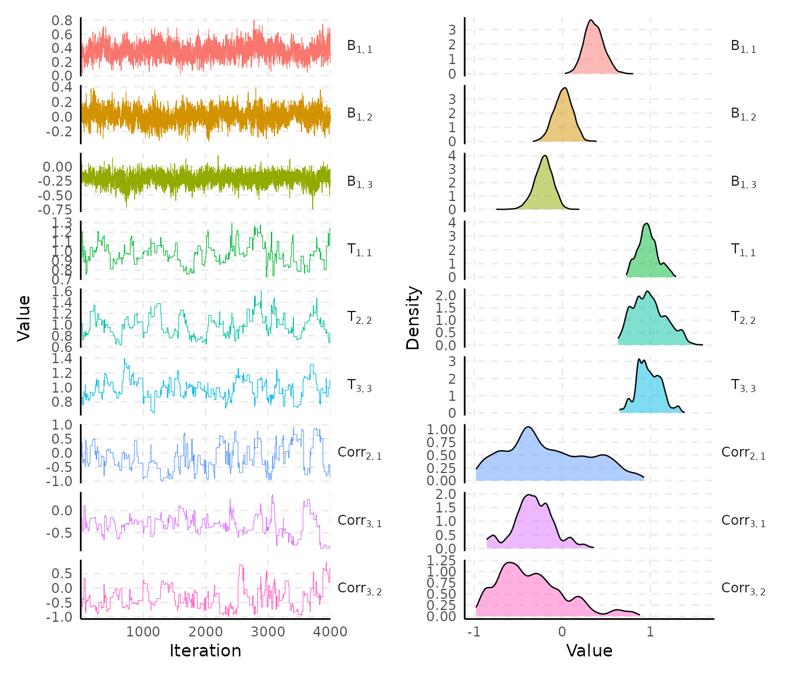
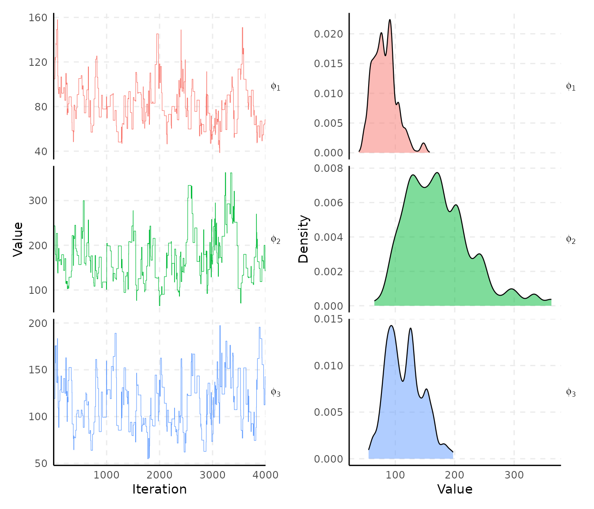
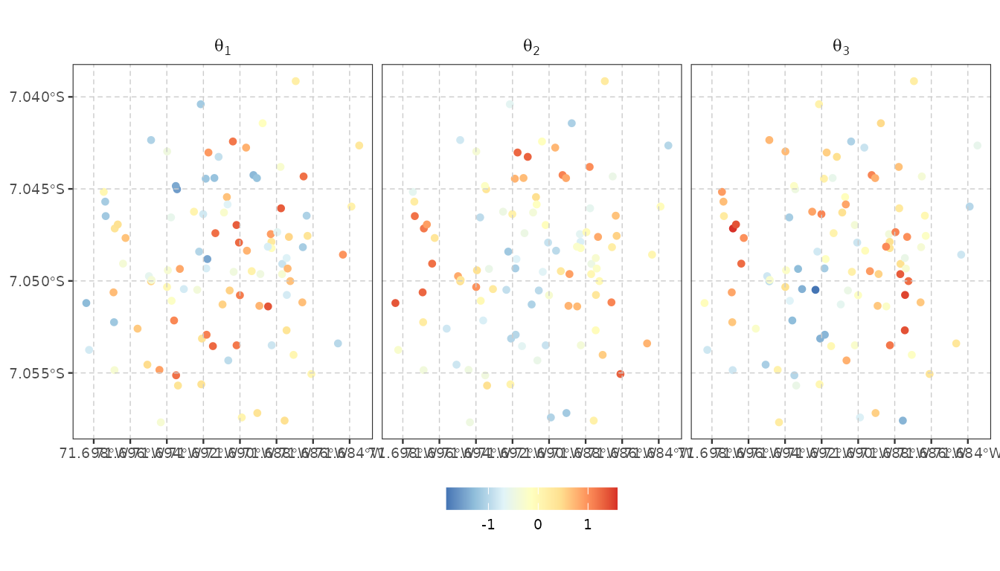

# Integrated workflow

[`vignette("spifa")`](https://ErickChacon.github.io/spifa/articles/spifa.md)
fits the full spatial model directly, using a discrimination restriction
and a spatial range prior already decided. In practice both could be
informed by previous knowledge or a preliminary analysis on the data
itself. This vignette walks through that preliminary analysis, then fits
the full model:

1.  Perform non-spatial exploratory item factor analysis to suggest a
    discrimination structure using the **mirt** package.
2.  Analyse the empirical variogram of that fit’s factor scores to
    suggest a spatial range using the **gstat** package.
3.  Fit the full spatial model with
    [`spifa()`](https://ErickChacon.github.io/spifa/reference/spifa.md),
    using the restriction and range prior from the previous two steps.

``` r

library(mirt)
```

    #> Loading required package: stats4

    #> Loading required package: lattice

``` r

library(gstat)
library(sf)
```

    #> Linking to GEOS 3.12.1, GDAL 3.8.4, PROJ 9.4.0; sf_use_s2() is TRUE

``` r

library(spifa)
library(ggplot2)

data(ipixuna)
nitems <- ncol(ipixuna$items)
nfactors <- 3
```

## Step 1: Discrimination structure with `mirt`

[`mirt()`](https://philchalmers.github.io/mirt/reference/mirt.html)
requires named item columns; `ipixuna$items` doesn’t have any, so we
name them here:

``` r

items <- unclass(ipixuna$items)
colnames(items) <- paste0("item", seq_len(nitems))
head(items)
```

    #>      item1 item2 item3 item4 item5 item6 item7 item8 item9 item10
    #> [1,]     0     1     1     0     1     1     1     1     1      1
    #> [2,]     1     0     0     1     0     1     1     1     1      0
    #> [3,]     1     1     1     1     0     0     0     1     1      1
    #> [4,]     0     0     0     0     0     0     0     0     0      0
    #> [5,]     1     0     1     0     1     1     1     1     1      1
    #> [6,]     0     0     0     0     0     0     0     0     0      0

We fit an exploratory (unrestricted) 2PL item factor model and rotate it
(varimax) towards a simple structure:

``` r

set.seed(11)
efa <- mirt(items, model = nfactors, itemtype = "2PL", verbose = FALSE)
```

    #> Warning: EM cycles terminated after 500 iterations.

``` r

loadings <- summary(efa, rotate = "varimax", verbose = FALSE)$rotF
loadings
```

    #> 
    #> Loadings:
    #>        F1     F2     F3    
    #> item1          0.993       
    #> item2   0.351  0.438  0.373
    #> item3   0.249  0.409  0.654
    #> item4                 0.741
    #> item5   0.967 -0.250       
    #> item6   0.807  0.150 -0.164
    #> item7   0.741  0.115  0.323
    #> item8   0.181  0.145  0.750
    #> item9   0.589  0.506  0.496
    #> item10  0.875  0.241  0.404
    #> 
    #>                F1   F2    F3
    #> SS loadings 3.471 1.78 2.225

Thresholding small loadings to zero turns this into a `0`/`1`
restriction:

``` r

A <- (abs(loadings) > 0.24) * 1
A
```

    #>        F1 F2 F3
    #> item1   0  1  0
    #> item2   1  1  1
    #> item3   1  1  1
    #> item4   0  0  1
    #> item5   1  1  0
    #> item6   1  0  0
    #> item7   1  0  1
    #> item8   0  0  1
    #> item9   1  1  1
    #> item10  1  1  1

This is only one approach, different rotations could be applied
depending on the questionnaire and the latent construct under analysis.
In this example, we will use `A` to constrain discrimination parameters
to zero.

## Step 2: Spatial range with `gstat`

The second thing
[`vignette("spifa")`](https://ErickChacon.github.io/spifa/articles/spifa.md)
takes as given is `priors$range`, the prior for each Gaussian process’s
spatial range. `mirt`’s factor scores give a first estimate of each
household’s latent abilities, which we can examine spatially with an
empirical variogram.

### Estimate the latent factors

First, we obtain the estimated latent factors using `fscores` from
**mirt**:

``` r

fscore <- fscores(efa, rotate = "varimax")
colnames(fscore) <- paste0("F", seq_len(nfactors))
head(fscore)
```

    #>              F1          F2          F3
    #> [1,]  1.3211407 -0.08912794  0.40562255
    #> [2,] -0.5322310  0.80842440  0.08238761
    #> [3,] -0.5511549  1.13429362  1.26588181
    #> [4,] -1.1083551 -0.63914342 -0.86797847
    #> [5,]  0.9604463  1.01333822  0.05713584
    #> [6,] -1.1083551 -0.63914342 -0.86797847

Then, we need to geo-reference these factor scores in order to perform
spatial analysis. `gstat` uses the default coordinates units to compute
distances between locations, so we will also transform the coordinates
system to a planar one where distances can be computed in meters:

``` r

fscore_sf <- st_sf(
  id = ipixuna$id, wealth = ipixuna$wealth, as.data.frame(fscore),
  geometry = st_transform(st_geometry(ipixuna), 32719)
)
fscore_sf
```

    #> Simple feature collection with 100 features and 5 fields
    #> Geometry type: POINT
    #> Dimension:     XY
    #> Bounding box:  xmin: 201883.2 ymin: 9219014 xmax: 203528.6 ymax: 9221070
    #> Projected CRS: WGS 84 / UTM zone 19S
    #> First 10 features:
    #>    id      wealth          F1          F2          F3                 geometry
    #> 1   1 -0.57212306  1.32114072 -0.08912794  0.40562255 POINT (202051.7 9219614)
    #> 2   2 -0.92003870 -0.53223099  0.80842440  0.08238761 POINT (203142.2 9221070)
    #> 3   3  1.23197630 -0.55115490  1.13429362  1.26588181 POINT (203106.4 9220133)
    #> 4   4  0.30801774 -1.10835509 -0.63914342 -0.86797847 POINT (202804.6 9220098)
    #> 5   5 -0.06247617  0.96044628  1.01333822  0.05713584 POINT (203407.1 9219495)
    #> 6   6  2.05414943 -1.10835509 -0.63914342 -0.86797847 POINT (202764.3 9220705)
    #> 7   7  2.30552728 -1.42214199  0.88292663 -0.98076254 POINT (202274.5 9219862)
    #> 8   8  0.16913811 -0.70539249  0.88627583 -0.01411773   POINT (203219 9220140)
    #> 9   9 -0.21989753  0.03337854 -1.44721269 -0.92935929 POINT (202584.1 9219519)
    #> 10 10 -0.91744763  0.08478991  1.65515016  0.33080265 POINT (203053.4 9220554)

### Evaluate predictors effects

We can evaluate the effect of wealth on this estimated latent factors:

``` r

fscore_sf |>
  tidyr::pivot_longer(F1:F3) |>
  ggplot(aes(wealth, value)) +
    geom_point() +
    geom_smooth(method = 'lm', formula = y ~ x) +
    facet_wrap(~ name) +
    theme_bw()
```



There seems to be an effect in F1 and F3, so we will analyse the
residual spatial structure after taking into account `wealth` effect:

### Evaluate the spatial structure

From `gstat`, we can use
[`variogram()`](https://r-spatial.github.io/gstat/reference/variogram.html)
to obtain the empirical variogram,
[`vgm()`](https://r-spatial.github.io/gstat/reference/vgm.html) to
define a theoretical variogram and
[`fit.variogram()`](https://r-spatial.github.io/gstat/reference/fit.variogram.html)
to fit the theoretical model to the empirical variogram.

``` r

vg1 <- variogram(F1 ~ wealth, fscore_sf, width = 20, cutoff = 1000)
vg1_fit <- fit.variogram(vg1, model = vgm(psill = 0.6, "Exp", range = 100, nugget = 0.1))
vg1_fit
```

    #>   model     psill    range
    #> 1   Nug 0.1864819  0.00000
    #> 2   Exp 0.3435766 27.67716

``` r

plot(vg1, vg1_fit, pch = 19, main = "F1")
```



For F1, we can see that there is some evidence of spatial correlation at
small scale.

``` r

vg2 <- variogram(F2 ~ wealth, fscore_sf, width = 50, cutoff = 1000)
vg2_fit <- fit.variogram(vg2, model = vgm(psill = 0.6, "Exp", range = 100, nugget = 0.1))
vg2_fit
```

    #>   model     psill    range
    #> 1   Nug 0.2075966   0.0000
    #> 2   Exp 0.4376844 170.9042

``` r

plot(vg2, vg2_fit, pch = 19, main = "F2")
```



For F2, there is a much clearer spatial structure with a range parameter
around `170`.

``` r

vg3 <- variogram(F3 ~ wealth, fscore_sf, width = 50, cutoff = 800)
vg3_fit <- fit.variogram(vg3, model = vgm(psill = 0.6, "Exp", range = 100, nugget = 0.1))
```

    #> Warning in fit.variogram(vg3, model = vgm(psill = 0.6, "Exp", range = 100, : No convergence after
    #> 200 iterations: try different initial values?

``` r

vg3_fit
```

    #>   model     psill   range
    #> 1   Nug 0.0000000  0.0000
    #> 2   Exp 0.6250431 16.9448

``` r

plot(vg3, vg3_fit, pch = 19, main = "F3")
```



For F3 also the range parameter seems to be small.

In general, there is some evidence of spatial correlation in the latent
factors, and specifically in F2 the spatial structure is strong with a
range parameter around 170. This gives a good understanding of plausible
values for the range parameters of our `spifa` model. However, remember
that the `spifa` and `mirt` models are not exactly the same, so these
values should be taken only as a reference to decide on our
`constraints` and `priors`.

## Step 3: Spatial modelling with `spifa`

With `A` from Step 1 and a range prior from Step 2 in hand,
[`spifa()`](https://ErickChacon.github.io/spifa/reference/spifa.md) can
fit the full spatial model, one independent Gaussian process per factor
by default. For the range prior, F2’s estimate is the one clear signal –
with only 100 households, F1 and F3’s much smaller ranges are more
likely noise than genuine short-range structure – so we use a common
reference value of 150 (close to F2’s ~170) for all three factors:

``` r

set.seed(1)
samples <- spifa(
  items ~ wealth, data = ipixuna, nfactors = nfactors,
  burnin = 1000, niter = 4000,
  constraints = list(discrimination = A, loading = diag(nfactors)),
  priors = list(range = list(initial = 150, mean = 150, sd = 0.4)))
samples
```

    #> Item factor analysis model: spifa_pred
    #> Formula: items ~ wealth
    #> Dimensions: 100 respondents, 10 items, 3 latent factors, 3 spatial processes
    #> MCMC: 1 chain, iter = 4000, thin = 1, samples = 4000
    #> 
    #> Item model parameters:
    #>           mean median   sd    q10    q90 ess_bulk rhat
    #> c[1]    -0.498 -0.497 0.33 -0.893 -0.090       76    1
    #> c[2]    -0.549 -0.551 0.25 -0.850 -0.237       92    1
    #> c[3]    -0.574 -0.574 0.28 -0.938 -0.219      104    1
    #> c[4]    -0.352 -0.349 0.21 -0.612 -0.098      198    1
    #> c[5]    -0.370 -0.350 0.29 -0.747 -0.016      129    1
    #> c[6]     0.015  0.019 0.22 -0.263  0.285      236    1
    #> c[7]     0.215  0.203 0.23 -0.070  0.516      185    1
    #> c[8]     0.159  0.147 0.22 -0.108  0.451      272    1
    #> c[9]     0.704  0.661 0.38  0.271  1.193       66    1
    #> c[10]    0.391  0.379 0.31  0.011  0.789      158    1
    #> A[2,1]  -0.313 -0.306 0.22 -0.593 -0.039      238    1
    #> A[3,1]  -0.106 -0.103 0.23 -0.401  0.180      310    1
    #> A[5,1]  -1.698 -1.667 0.45 -2.300 -1.135      100    1
    #> A[6,1]  -1.241 -1.214 0.31 -1.651 -0.859      151    1
    #> A[7,1]  -1.122 -1.095 0.33 -1.544 -0.723       85    1
    #> A[9,1]  -1.041 -1.007 0.34 -1.503 -0.628      137    1
    #> A[10,1] -1.414 -1.397 0.34 -1.875 -0.989      168    1
    #> A[1,2]   1.189  1.153 0.38  0.722  1.715       89    1
    #> A[2,2]   0.715  0.705 0.22  0.440  1.008      426    1
    #> A[3,2]   0.688  0.680 0.29  0.314  1.074      195    1
    #> A[5,2]  -0.111 -0.099 0.31 -0.523  0.279      141    1
    #> A[9,2]   0.948  0.927 0.38  0.475  1.430      115    1
    #> A[10,2]  0.193  0.192 0.31 -0.190  0.577      155    1
    #> A[2,3]   0.494  0.484 0.25  0.180  0.816      266    1
    #> A[3,3]   0.924  0.920 0.23  0.637  1.217      324    1
    #> A[4,3]   0.863  0.833 0.27  0.544  1.238      137    1
    #> A[7,3]   0.652  0.630 0.25  0.351  0.984      177    1
    #> A[8,3]   1.009  0.986 0.29  0.656  1.401      214    1
    #> A[9,3]   0.833  0.819 0.30  0.456  1.229      181    1
    #> A[10,3]  1.068  1.042 0.33  0.679  1.503      162    1
    #> 
    #> Factor model parameters:
    #>               mean  median    sd    q10     q90 ess_bulk rhat
    #> B[1,1]      0.3593   0.352  0.11   0.22   0.503      186  1.0
    #> B[1,2]      0.0098   0.013  0.10  -0.13   0.142      292  1.0
    #> B[1,3]     -0.2136  -0.209  0.10  -0.35  -0.084      529  1.0
    #> T[1,1]      0.9689   0.962  0.11   0.83   1.134       35  1.0
    #> T[2,2]      0.9867   0.970  0.19   0.75   1.256       32  1.0
    #> T[3,3]      0.9811   0.965  0.14   0.83   1.155       40  1.0
    #> phi[1]     82.1705  80.151 19.87  57.43 106.581       33  1.0
    #> phi[2]    172.9428 165.389 55.89 108.35 243.588       45  1.0
    #> phi[3]    115.9469 114.255 29.58  82.03 155.454       55  1.0
    #> Corr[2,1]  -0.1652  -0.255  0.47  -0.76   0.511       38  1.1
    #> Corr[3,1]  -0.3286  -0.334  0.23  -0.60  -0.073       39  1.1
    #> Corr[3,2]  -0.3482  -0.429  0.38  -0.81   0.181       46  1.1
    #> 
    #> ess_bulk is the bulk effective sample size; rhat is the potential
    #> scale reduction factor on split chains (Rhat = 1 at convergence).
    #> Use summary() for the full set of statistics (incl. ess_tail).

Note this uses
[`spifa()`](https://ErickChacon.github.io/spifa/reference/spifa.md)’s
own default (non-informed) initial values for everything except the
spatial range – the same starting point a real user, without further
domain knowledge, would use. The full analysis can now proceed using the
methods presented in
[`vignette("spifa")`](https://ErickChacon.github.io/spifa/articles/spifa.md)
and the package’s other vignettes.

### Visualize

Let’s visualize the chains and densities of the posterior. Observe which
parameters have better mixing than others.

``` r

plot(samples, c("c", "A"))
```



``` r

plot(samples, select = c("B", "T", "Corr"))
```



``` r

plot(samples, select = c("phi"))
```



### Predict

Let’s visualize the spatial pattern of the latent factors mean
prediction.

``` r

pred_samples <- predict(samples)
plot_predict(pred_samples) +
  scale_colour_distiller(palette = "RdYlBu")
```



You can continue your analysis using the other methods and functions
shown in the package’s vignettes.
