In this vignette, we show how to use the package to fit a 2 parameter model.

## Required packages


```r
rm(list = ls())
library(spmirt)
library(datasim)
library(coda)
library(tidyverse)
```

```
#> Loading tidyverse: ggplot2
#> Loading tidyverse: tibble
#> Loading tidyverse: tidyr
#> Loading tidyverse: readr
#> Loading tidyverse: purrr
#> Loading tidyverse: dplyr
```

```
#> Conflicts with tidy packages -----------------------------------------------------------------------
```

```
#> filter(): dplyr, stats
#> lag():    dplyr, stats
```

# Example 1

## Simulation of the data


```r
q <- q1 <- q2 <- 10
n <- 300
difficulty <- matrix((1:q - 5)/10 * 2, nrow = 1)
discrimination1 <- matrix(seq(0.4, 1.5, length.out = q), nrow = 1)
discrimination2 <- matrix(runif(q, 0, 1.5), nrow = 1)

f <- list(
  prob ~ mfa(ones, beta = get("difficulty")) +
    re(id, sigma = 1, q = get("q1")):mfa(ones, beta = get("discrimination1")) +
    re(id, sigma = 1, q = get("q2")):mfa(ones, beta = get("discrimination2")),
  size ~ I(1)
  )

data_long <- sim_model(formula = f,
                        link_inv = list(pnorm, identity),
                        generator = rbinom,
                        responses = q,
                        n = n)
# ,
#                         seed = 1)

data_long <- dplyr::rename(data_long, subject = id, ability1 = re.id.prob,
                           ability2 = re.id.prob.1,
                           item = response_label, y = response)
```


| subject|ones |   ability1|   ability2|      prob| size|  y| item|
|-------:|:----|----------:|----------:|---------:|----:|--:|----:|
|       1|1    |  0.5050329|  0.0787423| 0.3042432|    1|  0|    1|
|       2|1    | -0.5220388|  1.1892345| 0.6126676|    1|  0|    1|
|       3|1    |  0.9736871| -2.0402063| 0.0042399|    1|  0|    1|
|       4|1    | -0.9136706|  0.1096681| 0.1477717|    1|  1|    1|
|       5|1    |  2.6819730|  0.6882292| 0.8466760|    1|  0|    1|
|       6|1    |  0.4098907| -0.7975470| 0.0662155|    1|  0|    1|
|       7|1    | -0.2700024| -0.3580229| 0.0971620|    1|  0|    1|
|       8|1    |  1.9209122|  1.0668778| 0.8708063|    1|  1|    1|
|       9|1    |  0.8125621| -1.1754022| 0.0396292|    1|  0|    1|
|      10|1    | -0.7847412| -1.6946555| 0.0015412|    1|  0|    1|
|      11|1    |  0.1916143|  0.2226532| 0.3153003|    1|  1|    1|
|      12|1    |  0.1332977|  0.9612644| 0.6179688|    1|  0|    1|
|      13|1    | -0.6372298|  1.2371400| 0.6149989|    1|  1|    1|
|      14|1    |  0.9386858|  0.9408498| 0.7257715|    1|  0|    1|
|      15|1    | -0.7201072|  0.8836122| 0.4499546|    1|  0|    1|
|      16|1    |  1.1001074|  0.5388581| 0.5897366|    1|  0|    1|
|      17|1    |  1.6007200| -0.4778312| 0.2482278|    1|  0|    1|
|      18|1    | -0.3331414|  0.7873307| 0.4697726|    1|  0|    1|
|      19|1    |  1.1374960| -1.1321285| 0.0572936|    1|  0|    1|
|      20|1    | -0.4586176| -0.1233287| 0.1318361|    1|  0|    1|


```r
explor <- data_long %>%
  group_by(subject) %>%
  summarize(endorse = mean(y), ability1 = unique(ability1), ability2 = unique(ability2))
ggplot(explor, aes(ability1, endorse)) + geom_point()
```

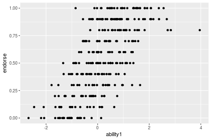

```r
ggplot(explor, aes(ability2, endorse)) + geom_point()
```

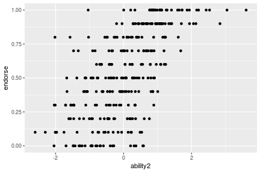


## Fitting the model


```r
iter <- 10
system.time(samples <- ifa_gibbs(data_long$y, n, q, iter, 2))
```

```
#>    user  system elapsed 
#>   0.784   0.496   0.367
```

```r
purrr::map(samples, dim)
```

```
#> $theta
#> [1]  10 600
#> 
#> $c
#> [1] 10 10
#> 
#> $a
#> [1] 10 20
#> 
#> $z
#> [1]   10 3000
```


```r
plot(samples$theta[, 1 + c(1, 301)])
points(0, 0, pch = 19, col = 2)
points(samples$theta[, 2 + c(1, 301)], col = 3)
points(samples$theta[, 3 + c(1, 301)], col = 4)
points(samples$theta[, 4 + c(1, 301)], col = 5)
points(samples$theta[, 5 + c(1, 301)], col = 6)
points(samples$theta[, 6 + c(1, 301)], col = 7)
```


```r
# plot(samples$theta[, 17 + c(1, 301)], type = "b", col = rgb(0, 0, 0, 0.2))
plot(samples$theta[, 6 + c(1, 301)], type = "b", col = rgb(0, 0, 0, 0.2))
points(0, 0, pch = 19, col = 2)
```

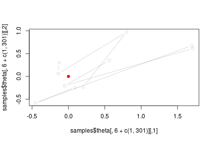

```r
plot(samples$a[, 0 + c(1, 11)], type = "b", col = rgb(0, 0, 0, 0.1))
points(0, 0, pch = 19, col = 2)
```

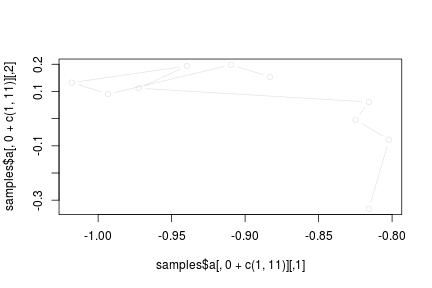

```r
plot(samples$a[, 1 + c(1, 11)], type = "b", col = rgb(0, 0, 0, 0.1))
points(0, 0, pch = 19, col = 2)
```


```r
plot(samples$a[, 2 + c(1, 11)], type = "b", col = rgb(0, 0, 0, 0.1))
points(0, 0, pch = 19, col = 2)
```


```r
plot(samples$a[, 3 + c(1, 11)], type = "b", col = rgb(0, 0, 0, 0.1))
points(0, 0, pch = 19, col = 2)
```


```r
plot(samples$a[, 4 + c(1, 11)], type = "b", col = rgb(0, 0, 0, 0.1))
points(0, 0, pch = 19, col = 2)
```

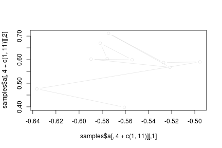

```r
plot(samples$a[, 5 + c(1, 11)], type = "b", col = rgb(0, 0, 0, 0.1))
points(0, 0, pch = 19, col = 2)
```


```r
plot(samples$a[, 6 + c(1, 11)], type = "b", col = rgb(0, 0, 0, 0.1))
points(0, 0, pch = 19, col = 2)
```


```r
k <- 1
image(MASS::kde2d(samples$a[, k], samples$a[, k + 10], n = 100))
```

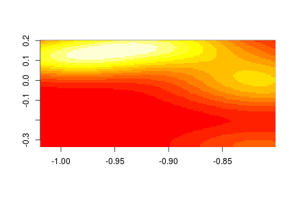

```r
k <- 2
image(MASS::kde2d(samples$a[, k], samples$a[, k + 10], n = 100))
```

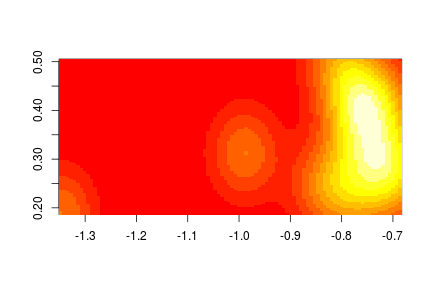

```r
k <- 4
image(MASS::kde2d(samples$a[, k], samples$a[, k + 10], n = 100))
```

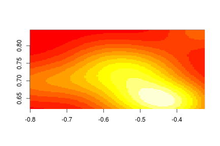

```r
k <- 5
image(MASS::kde2d(samples$a[, k], samples$a[, k + 10], n = 100))
```

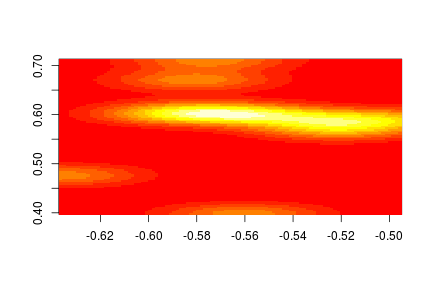

```r
k <- 6
image(MASS::kde2d(samples$a[, k], samples$a[, k + 10], n = 100))
```

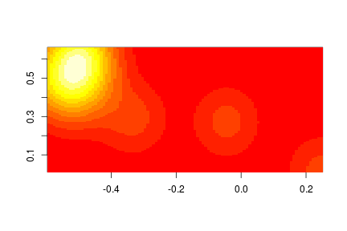

```r
k <- 7
image(MASS::kde2d(samples$a[, k], samples$a[, k + 10], n = 100))
```

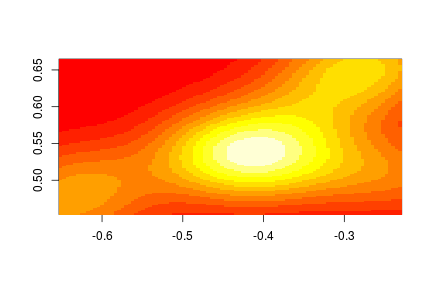

```r
k <- 8
image(MASS::kde2d(samples$a[, k], samples$a[, k + 10], n = 100))
```

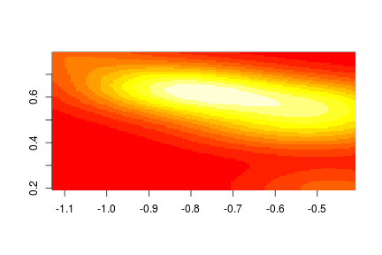

```r
k <- 9
image(MASS::kde2d(samples$a[, k], samples$a[, k + 10], n = 100))
```


## Evaluate the results


```r
# Organize and summarise output
samples_after_burin <- samples %>% purrr::map(~ .[(0.6 * iter):iter, ])
samples_params <- samples_after_burin[1:3]
samples_params_summary <- samples_params %>%
  map(~ apply(., 2, function (x) quantile(x, c(0.025, 0.5, 0.975)))) %>%
  map(~ as_tibble(t(.))) %>%
  map(~ setNames(., make.names(names(.))))

# Visualize convergence
opar <- par(mfrow = c(2, 2), mar = c(2, 1.9, 2, 0.6))
map(samples_after_burin, ~ plot(mcmc(.[, 1:5]), auto.layout = FALSE))
```

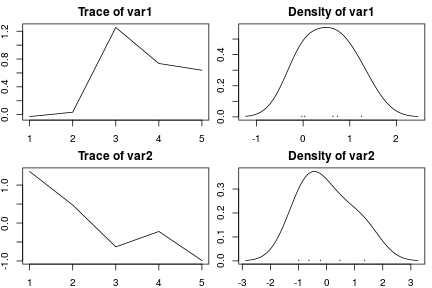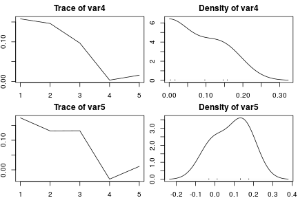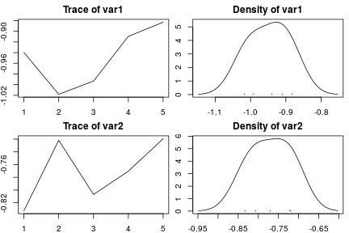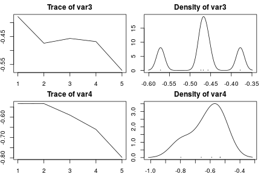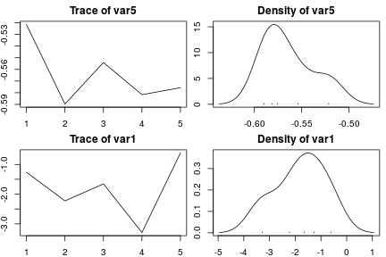

```
#> $theta
#> NULL
#> 
#> $c
#> NULL
#> 
#> $a
#> NULL
#> 
#> $z
#> NULL
```

```r
par(opar)

# Matching parameters
samples_params_summary$theta <- samples_params_summary$theta %>%
  mutate(
    param1 = c(unique(data_long$ability1), unique(data_long$ability2)),
    param2 = c(unique(data_long$ability1), - unique(data_long$ability2)),
    param3 = c(- unique(data_long$ability1), unique(data_long$ability2)),
    param4 = - c(unique(data_long$ability1), unique(data_long$ability2)),
    param5 = c(unique(data_long$ability2), unique(data_long$ability1)),
    param6 = c(unique(data_long$ability2), - unique(data_long$ability1)),
    param7 = c(- unique(data_long$ability2), unique(data_long$ability1)),
    param8 = - c(unique(data_long$ability2), unique(data_long$ability1)),
         )
samples_params_summary$a <- samples_params_summary$a %>%
  mutate(
    param1 = c(discrimination1, discrimination2),
    param2 = c(discrimination1, - discrimination2),
    param3 = c(- discrimination1, discrimination2),
    param4 = - c(discrimination1, discrimination2),
    param5 = c(discrimination2, discrimination1),
    param6 = c(discrimination2, - discrimination1),
    param7 = c(- discrimination2, discrimination1),
    param8 = - c(discrimination2, discrimination1),
         )
samples_params_summary$c$param <- c(difficulty)

# Visualize results
samples_params_summary$theta %>% gather(key, param, param1:param4) %>%
  ggplot(., aes(X50., param)) +
    geom_errorbar(aes(ymin = X2.5., ymax = X97.5.)) +
    geom_point(col = 2) +
    facet_wrap(~ key)
```


```r
samples_params_summary$theta %>% gather(key, param, param5:param8) %>%
  ggplot(., aes(X50., param)) +
    geom_errorbar(aes(ymin = X2.5., ymax = X97.5.)) +
    geom_point(col = 2) +
    facet_wrap(~ key)
```


```r
samples_params_summary$a %>% gather(key, param, param1:param4) %>%
  ggplot(., aes(X50., param)) +
    geom_errorbar(aes(ymin = X2.5., ymax = X97.5.)) +
    geom_point(col = 2) +
    facet_wrap(~ key)
```


```r
samples_params_summary$a %>% gather(key, param, param5:param8) %>%
  ggplot(., aes(X50., param)) +
    geom_errorbar(aes(ymin = X2.5., ymax = X97.5.)) +
    geom_point(col = 2) +
    facet_wrap(~ key)
```


```r
samples_params_summary$c %>%
  ggplot(., aes(X50., param)) +
    geom_errorbar(aes(ymin = X2.5., ymax = X97.5.)) +
    geom_point(col = 2)
```

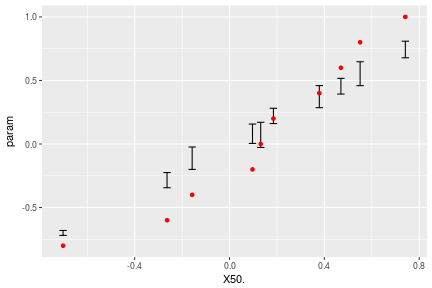

Correlation


```r
ability_real <- matrix(unique(c(data_long$ability1, data_long$ability2)), ncol = 2)
ability_estimate <- matrix(samples_params_summary$theta$X50., ncol = 2)
cor(ability_real)
```

```
#>             [,1]        [,2]
#> [1,] 1.000000000 0.007635293
#> [2,] 0.007635293 1.000000000
```

```r
cor(ability_estimate)
```

```
#>            [,1]       [,2]
#> [1,]  1.0000000 -0.5090926
#> [2,] -0.5090926  1.0000000
```

```r
cov(ability_real)
```

```
#>            [,1]       [,2]
#> [1,] 1.03588111 0.00791367
#> [2,] 0.00791367 1.03703773
```

```r
cov(ability_estimate)
```

```
#>            [,1]       [,2]
#> [1,]  0.9207947 -0.4570002
#> [2,] -0.4570002  0.8751376
```

```r
A <- cbind(c(discrimination1), c(discrimination2))
solve(crossprod(A) + diag(1, 2))
```

```
#>            [,1]       [,2]
#> [1,]  0.2046189 -0.1555381
#> [2,] -0.1555381  0.2089335
```

```r
tcrossprod(A)
```

```
#>            [,1]      [,2]      [,3]      [,4]      [,5]     [,6]     [,7]     [,8]     [,9]
#>  [1,] 1.3459535 1.7877874 0.8427609 0.9616023 1.2036540 1.367155 1.696168 1.863234 2.025266
#>  [2,] 1.7877874 2.3747551 1.1153503 1.2723075 1.5932987 1.809713 2.246478 2.467639 2.682096
#>  [3,] 0.8427609 1.1153503 0.7038573 0.8171275 0.9911723 1.126471 1.343411 1.480468 1.615042
#>  [4,] 0.9616023 1.2723075 0.8171275 0.9494620 1.1498387 1.306836 1.555237 1.714203 1.870389
#>  [5,] 1.2036540 1.5932987 0.9911723 1.1498387 1.3966152 1.587219 1.896183 2.089336 2.278888
#>  [6,] 1.3671550 1.8097126 1.1264713 1.3068363 1.5872185 1.803836 2.154811 2.374322 2.589747
#>  [7,] 1.6961682 2.2464784 1.3434108 1.5552369 1.8961829 2.154811 2.586889 2.849253 3.106340
#>  [8,] 1.8632342 2.4676386 1.4804682 1.7142032 2.0893356 2.374322 2.849253 3.138331 3.421631
#>  [9,] 2.0252658 2.6820963 1.6150424 1.8703893 2.2788881 2.589747 3.106340 3.421631 3.730664
#> [10,] 0.6484694 0.8478622 0.9905747 1.1767669 1.3679947 1.556012 1.750794 1.938957 2.126915
#>           [,10]
#>  [1,] 0.6484694
#>  [2,] 0.8478622
#>  [3,] 0.9905747
#>  [4,] 1.1767669
#>  [5,] 1.3679947
#>  [6,] 1.5560122
#>  [7,] 1.7507941
#>  [8,] 1.9389573
#>  [9,] 2.1269147
#> [10,] 2.2519809
```

```r
A_est <- matrix(samples_params_summary$a$X50., ncol = 2)

plot(tcrossprod(A), tcrossprod(A_est))
abline(0, 1)
```

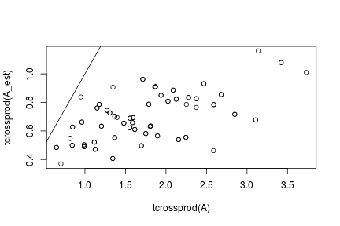
